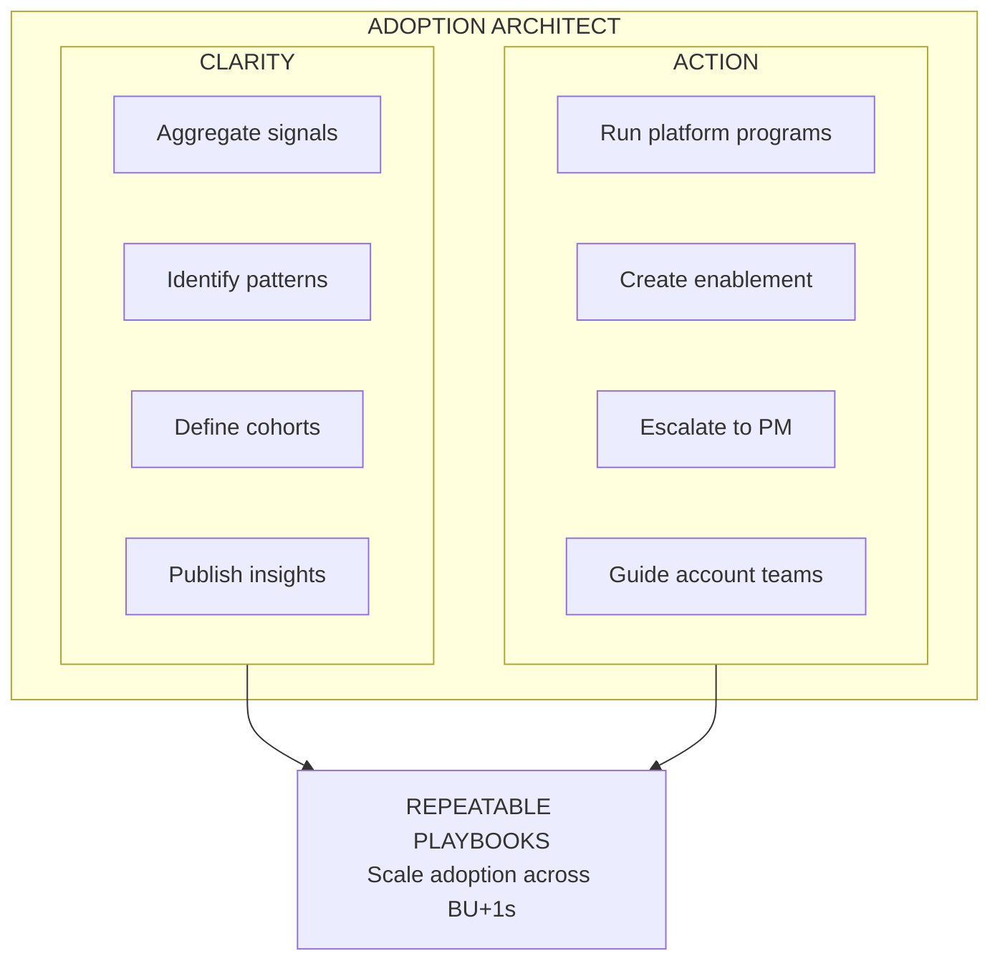

# Mission and Role: Adoption Architect Lead

## Mission Statement

**Drive deliberate, field-led adoption of Databricks Apps—not waiting for organic product-led growth, but building the GTM muscle, plays, and metrics to make Apps a strategic attach motion.**

---

## The Problem We Solve

Adoption signals and blockers are fragmented across accounts and teams, which creates:
- Opaque adoption progress
- Reactive escalations
- Inconsistent execution in the field
- Missed product outcomes

---

## Our Belief

When adoption friction is made visible (by BU+1 and cohort) and paired with coordinated cross-functional action, customer time-to-value improves—and repeatable playbooks + shared expertise scale adoption across the business.

---

## Role Definition: Adoption Architect

**Core Mandate:** Create clarity on what's blocking adoption and drive action that removes friction at scale.

### Clarity (Insight into Adoption Friction)

| Deliverable | Description |
|-------------|-------------|
| **BU+1-Level Newsletters** | Product line trends + roadmap impact communicated to stakeholders |
| **Loss Analysis** | Understanding what adoption gaps contributed to churn or failed expansion |
| **Aggregated Product Blockers** | Patterns, severity, and owners identified across accounts |
| **Adoption Cohorts** | Target customer groups with measurable outcomes defined |

### Action (Cross-Functional Execution)

| Activity | Description |
|----------|-------------|
| **Platform Programs** | Proactive, prescriptive adoption motions at scale |
| **Enablement Content** | Best-practice content tailored and distributed to BU+1s |
| **Voice to PM** | Structured feedback + prioritization for escalations |
| **Expert Guidance** | Unblock accounts now, then standardize learnings into repeatable plays |

---

## Operating Model

---

## Success Metrics (To Be Defined)

| Metric Category | Example Metrics |
|-----------------|-----------------|
| Adoption Velocity | Time-to-first-value, Time-to-expansion |
| Friction Reduction | Blockers resolved per quarter, Escalation turnaround time |
| Playbook Scale | # of accounts using standardized plays, Win rate on playbook accounts |
| Stakeholder Impact | BU+1 satisfaction, Field NPS on enablement |

---

## Open Questions

- [ ] What are the explicit OKRs for this role?
- [ ] Who are the BU+1s in scope?
- [ ] What is the team/resource structure?
- [ ] What existing infrastructure exists for this function?

---

*Last Updated: January 2026*

