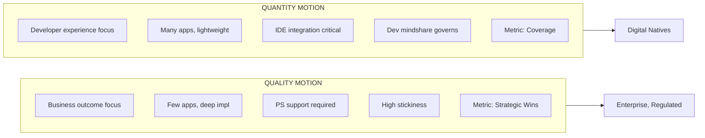

# ICP and Targeting

*Owner: Field Ops / Sales Strategy*

---

## Ideal Customer Profile for Apps

| Dimension | Criteria |
|-----------|----------|
| **Platform Maturity** | Already using Databricks for analytics/ML |
| **Use Case** | Building new data-intensive applications |
| **Buyer** | Data team with business unit sponsorship |
| **Tech Stack** | Open to Python/modern frameworks (not legacy Java/.NET) |
| **AI Interest** | Wants AI-powered applications |

---

## Customer Segmentation: Quality vs Quantity Motion

Apps adoption requires **two distinct motions** based on customer profile. Matching motion to customer is critical for retention.

### Motion Selection Guide

| Customer Profile | Primary Motion | Key Success Factors |
|------------------|----------------|---------------------|
| **Enterprise (Regulated)** | Quality | PS engagement, deep use case fit, governance |
| **Enterprise (Non-Regulated)** | Quality | Business value, FE support, ease of use |
| **Digital Native** | Quantity | Developer experience, IDE integration, self-serve |

### Motion Comparison

| Dimension | Quality Motion | Quantity Motion |
|-----------|----------------|-----------------|
| **Customer Profile** | Business outcome-oriented | Tech/Developer-centric |
| **Typical Segment** | Enterprise, Regulated | Digital Native (DN) |
| **App Count** | Few (1-5 deep apps) | Many (10+ lightweight apps) |
| **Implementation Depth** | Deep, production-grade | Lightweight, often ephemeral |
| **Success Metric** | Strategic Wins, Retention | Coverage, Active Developers |
| **Support Model** | Professional Services | Self-serve, IDE integration |
| **Phase Focus** | P1 (Prove It) | P2-P3 (Scale/Expand) |

---

## Disqualifiers (For Now)

| Signal | Reason |
|--------|--------|
| Legacy app migration priority | Platform not ready yet |
| Hyperscaler-first strategy | Harder to displace |
| No existing Databricks footprint | Cold start too hard |
| Pure IT buyer (no business sponsor) | Hard to show business value |

---

## Lighthouse Account Selection Criteria

| Signal | Why It Matters |
|--------|----------------|
| **Strat Hunter designation** | Pre-qualified strategic importance |
| **High platform adoption** | Data gravity creates Apps opportunity |
| **Strong data gravity** | More data = more Apps use cases |
| **AI maturity** | Deep vertical app opportunity |
| **Strong partner ecosystem** | SI/ISV can accelerate delivery |

---

## App Archetype Targeting

| Archetype | Target Signal | Customer Profile | Priority |
|-----------|---------------|------------------|----------|
| **Business Cockpit** | Unity Catalog adoption | Established lakehouse, business stakeholder interest | High |
| **Deep Vertical** | AI adoption signals | Strategic lighthouse, needs beachhead, analytical maturity | High |
| **Horizontal** | Small teams OR large business presence | Platform productivity, new persona expansion | Medium |

### Targeting Matrix

| Signal | Cockpit | Vertical | Horizontal |
|--------|:-------:|:--------:|:----------:|
| **Unity Catalog adopted** | ✅ | | |
| **AI/ML maturity (models in prod)** | | ✅ | |
| **Large business user base** | ✅ | | ✅ |
| **Deep domain pain point** | | ✅ | |
| **Platform productivity needs** | | | ✅ |
| **Strong data gravity** | ✅ | ✅ | |
| **Executive sponsorship** | ✅ | ✅ | |
| **Small technical team** | | | ✅ |

---

## Verticals in Scope

| Vertical | Abbrev | Notes | Primary Archetype |
|----------|--------|-------|-------------------|
| Manufacturing | MFG | Supply chain, quality prediction | Vertical |
| Retail | RTL | Inventory, demand sensing | Cockpit |
| Health and Life Sciences | HLS | Regulated—security/compliance critical | Vertical |
| Financial Services | FSI | Regulated—security/compliance critical | Cockpit |
| Digital Natives | DN | Often more mature, faster adopters | Horizontal |

---

## Actions for Field Ops

| Action | Purpose | Priority |
|--------|---------|----------|
| Finalize lighthouse account list (10-15) | Focus strategic wins | High |
| Apply targeting matrix to pipeline | Identify Apps opportunities | High |
| Segment accounts by motion type | Match approach to customer | High |
| Update SFDC with archetype tags | Enable tracking | Medium |

---

*Last Updated: January 2026*

**Related:** [Sales Plays and Patterns](03_sales_plays_and_patterns.md) | [Hypotheses](../30_framework/01_hypotheses_and_beliefs.md#h8)

