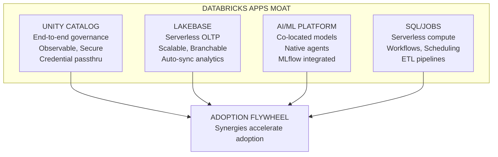

# Positioning and Messaging

*Owner: Marketing / Field Enablement*

---

## Core Differentiators

Databricks' strength in the app space comes from **platform synergy**, not standalone app capabilities.

> **Positioning Principle:** Lead with ecosystem value. Be honest about platform maturity. Win where we're strong; defer where we're not ready.

---

## The Databricks Apps Moat



---

## Where We Win Today

| Use Case Type | Why We Win | Moat Pillar |
|---------------|-----------|-------------|
| **Internal data apps** | No external exposure needed | Unity Catalog + Lakebase |
| **Analytics dashboards** | Data already in Lakehouse | SQL/Jobs + Unity Catalog |
| **AI-powered internal tools** | Co-located models | AI/ML + Lakebase |
| **Moderate-traffic apps** | Vertical scaling sufficient | All pillars |
| **Apps for authenticated users** | Databricks auth works | Unity Catalog |

---

## Where We Wait (Product Gaps)

| Use Case Type | Current Gap | Impact | When Ready |
|---------------|-------------|--------|------------|
| **External-facing public apps** | No public URLs without login, no firewall, no ingress/egress | Can't expose to internet safely | TBD |
| **High-burst traffic apps** | Vertical scaling only | Can't handle traffic spikes | TBD |
| **Cost-sensitive variable workloads** | Fixed 24x7 pricing | Cost objections | TBD |
| **GPU inference apps** | No GPU/custom hardware | Must use Model Serving instead | TBD |
| **Hybrid OLTP apps** | Lakebase only | Can't connect external DBs | TBD |
| **Branded customer portals** | No custom domains | Professional appearance blocker | TBD |

---

## Positioning Matrix

```
┌─────────────────────────────────────────────────────────────────┐
│                    POSITIONING MATRIX                           │
├─────────────────────────────────────────────────────────────────┤
│                                                                 │
│                    INTERNAL              EXTERNAL               │
│                    ────────              ────────               │
│   LOW TRAFFIC      ✅ SWEET SPOT         ⚠️ AUTH WORKAROUND     │
│                    Lead aggressively     Customer's auth layer  │
│                                                                 │
│   HIGH TRAFFIC     ⚠️ CAUTION            ❌ NOT READY           │
│                    Vertical limits       Wait for product       │
│                                                                 │
│   AI-POWERED       ✅ DIFFERENTIATED     ⚠️ INTERNAL ONLY       │
│                    Lead with moat        Model Serving + Apps   │
│                                                                 │
│   REGULATED        ✅ IF INTERNAL        ❌ COMPLIANCE GAPS     │
│   (FSI/HLS)        Unity Catalog shines  No ingress/egress      │
│                                                                 │
└─────────────────────────────────────────────────────────────────┘
```

---

## Honest Messaging by Maturity Stage

| Product Maturity | How to Position |
|------------------|-----------------|
| **Today (Early)** | "Best for internal, data-native apps that leverage your Lakehouse investment" |
| **FY26 (Growing)** | "Expanding to more use cases as App Spaces and cost controls mature" |
| **FY27+ (Mature)** | "Full-featured app platform with enterprise-grade external capabilities" |

---

## Key Messages by Audience

| Audience | Message | Caveat to Add If Asked |
|----------|---------|------------------------|
| **Data Leaders** | "Extend your Lakehouse investment to internal operational apps" | "External-facing apps are on the roadmap" |
| **App Developers** | "Build AI-powered apps without stitching together services" | "Best for moderate-traffic, internal use cases today" |
| **Security/Compliance** | "One governance model for data and applications" | "External exposure controls coming soon" |
| **Executives** | "Start consolidating your data+AI platform—apps included" | "We're building toward full parity" |

---

## Elevator Pitch

> "Databricks Apps lets you build **internal, data-native applications** where your data, AI, and governance already live—eliminating integration complexity for teams already invested in the Lakehouse."

**Note:** This pitch is honest about the sweet spot (internal, data-native). Expand as product matures.

---

## What NOT to Promise (Today)

| Don't Promise | Why | What to Say Instead |
|---------------|-----|---------------------|
| "Infinite scalability" | Vertical only | "Scales well for moderate workloads" |
| "Public-facing apps" | No external security | "Best for internal apps today" |
| "Pay-per-use pricing" | Fixed 24x7 | "Predictable pricing model" |
| "Full hyperscaler parity" | Still building | "Differentiated on data+AI integration" |

---

## Competitive Positioning

### Hyperscalers (AWS, Azure, GCP)

| Dimension | Hyperscalers | Databricks Apps |
|-----------|--------------|-----------------|
| **App Platform Maturity** | Fully featured | Still building |
| **Data Integration** | Separate services | Native Lakehouse |
| **AI/ML Integration** | Separate services | Co-located |
| **Governance** | Fragmented | Unified |
| **Lock-in Risk** | High | Lower (open formats) |

**Positioning vs. Hyperscalers:** Don't compete on app platform features. Win on data+AI integration and unified governance.

### Palantir

| Dimension | Palantir | Databricks Apps |
|-----------|----------|-----------------|
| **GTM Motion** | FDE (Forward Deployed Engineers) | Field Engineering + Self-serve |
| **Platform Maturity** | More fully featured | Still building |
| **Pricing** | Expensive | Competitive |
| **Solution Orientation** | Very high (custom solutions) | Emerging |

**Positioning vs. Palantir:** Open platform, better economics, leverage existing Databricks investment.

---

## Actions for Marketing/Enablement

| Action | Purpose | Priority |
|--------|---------|----------|
| Update messaging for honest positioning | Build trust, set expectations | High |
| Create talk track by audience | Consistent field messaging | High |
| Develop "what not to promise" training | Prevent over-commits | Medium |
| Build competitive positioning guides | Counter objections | Medium |

---

*Last Updated: January 2026*

**Related:** [Friction Summary](../20_product/03_friction_summary.md) | [Sales Plays](03_sales_plays_and_patterns.md)

