# Sales Plays and Patterns

*Owner: Field Enablement / Sales Strategy*

---

## App Archetypes Seeing Traction

Three distinct patterns of apps are gaining adoption:

```mermaid
flowchart LR
    subgraph Archetypes["APP ARCHETYPES"]
        BC["🎯 BUSINESS COCKPIT<br/>Full analytics stack<br/>for executives"]
        DV["🔬 DEEPLY VERTICAL<br/>Industry-specific<br/>AI-powered"]
        HZ["🛠️ HORIZONTAL<br/>Platform productivity<br/>tools"]
    end
    
    BC --> BusBuyer["Business Exec Buyer"]
    DV --> DomainBuyer["Domain Specialist Buyer"]
    HZ --> PlatformBuyer["Platform Team Buyer"]
```

---

## Archetype 1: Business Cockpit Apps

### Definition
An application that gives business persons a clear understanding of their business across the analytics maturity spectrum.

### The Analytics Maturity Stack

```mermaid
flowchart TB
    subgraph Cockpit["🎯 BUSINESS COCKPIT APP"]
        P["PRESCRIPTIVE: What should be done?"]
        S["SIMULATIONS: Plan for scenarios?"]
        PR["PREDICTIVE: Where is business going?"]
        C["CAUSAL: What is causing current state?"]
        D["DESCRIPTIVE: Where is business now?"]
        
        P --> S --> PR --> C --> D
    end
    
    Cockpit --> Value["Business users get FULL VISIBILITY<br/>without SQL skills"]
```

### Characteristics

| Dimension | Description |
|-----------|-------------|
| **Target User** | Business executives, analysts, operations managers |
| **Value Prop** | Full business visibility without technical skills |
| **AI Integration** | Predictions, scenarios, recommendations |
| **Data Needs** | Aggregated operational + analytical data |
| **Databricks Fit** | Perfect—leverages Lakehouse + ML + Lakebase |

### Example Use Cases
- Executive dashboard with scenario planning
- Operations command center with anomaly detection
- Sales forecasting with prescription recommendations
- Supply chain visibility with risk simulation

---

## Archetype 2: Deeply Vertical Apps

### Definition
Applications that address a deep pain point for a customer or completely disrupt a process for specific industry tasks.

### Characteristics

| Dimension | Description |
|-----------|-------------|
| **Target User** | Domain specialists, industry practitioners |
| **Value Prop** | Solve unsolvable problems or 10x process improvement |
| **AI Integration** | Often leverages cutting-edge AI (diffusion models, etc.) |
| **Data Needs** | Specialized, often proprietary data |
| **Databricks Fit** | Good—leverages AI platform + data gravity |

### Example Use Cases

| Industry | Use Case | Disruption |
|----------|----------|------------|
| **Manufacturing** | AI-based product design | Replace months of R&D with generative design |
| **Healthcare** | Clinical trial optimization | Accelerate drug development timelines |
| **Financial Services** | Real-time fraud network analysis | Move from batch to streaming detection |
| **Retail** | Demand sensing with external signals | Replace spreadsheet forecasting |

---

## Archetype 3: Horizontal Apps

### Definition
Applications that improve productivity within the platform for existing users OR reduce the barrier of entry for new user segments.

### Characteristics

| Dimension | Description |
|-----------|-------------|
| **Target User** | Platform users, data stewards, analysts |
| **Value Prop** | Democratize capabilities, reduce skill requirements |
| **AI Integration** | Often AI-assisted to lower skill barrier |
| **Data Needs** | Works with existing platform data |
| **Databricks Fit** | Excellent—extends platform value |

### Example Use Cases

| App Type | Description | Value |
|----------|-------------|-------|
| **Data Quality Checks** | Business/data rules defined by non-SQL users | Data stewards don't need SQL |
| **Catalog Browser** | Visual data discovery for business users | Analysts don't need Unity Catalog expertise |
| **Query Builder** | Natural language to SQL | Business users can self-serve |
| **Notebook Publisher** | Turn notebooks into shareable apps | Data scientists become app builders |

---

## Guided Selling Triggers

### Why Guided Selling Matters
FE often doesn't recognize Apps opportunities even when present. These triggers help identify when to bring Apps into the conversation.

### Conversation Triggers by Archetype

| Customer Says/Does | Apps Opportunity? | Archetype | Next Step |
|--------------------|-------------------|-----------|-----------|
| "We need a dashboard for executives" | ✅ Yes | Cockpit | Qualify: What decisions? What data? |
| "Our BI tool isn't working for business users" | ✅ Yes | Cockpit/Horizontal | Demo: Self-serve analytics app |
| "We have ML models but can't operationalize them" | ✅ Yes | AI App | Explore: Model serving in app layer |
| "We need real-time visibility into operations" | ✅ Yes | Cockpit | Qualify: What operations? Latency needs? |
| "Our industry has a unique problem no tool solves" | ✅ Yes | Vertical | Explore: Custom app opportunity |
| "Data team is bottleneck for business requests" | ✅ Yes | Horizontal | Demo: Self-serve data quality app |
| "We want to build a customer-facing portal" | ⚠️ Maybe | - | Check: Internal or external? (External = wait) |
| "We need to migrate our Java apps" | ❌ No | - | Defer: Not ready yet |
| "We need infinite scalability" | ❌ No | - | Defer: Vertical scaling only today |

### Account Signals to Watch

| Signal in Account | Apps Opportunity? | Why |
|-------------------|-------------------|-----|
| Unity Catalog adopted | ✅ Strong | Governance foundation ready |
| ML models in production | ✅ Strong | AI App opportunity |
| Business users requesting data access | ✅ Strong | Horizontal App opportunity |
| Large data footprint in Lakehouse | ✅ Strong | Data gravity for Apps |
| Executive sponsor identified | ✅ Strong | Top-down adoption path |
| Industry-specific pain point mentioned | ✅ Strong | Vertical App opportunity |
| No Databricks footprint | ❌ Weak | Cold start too hard |
| Legacy migration is priority | ❌ Weak | Not ready yet |

---

## Sales Objection Framework

### Objection 1: Money
> "Will this product make money for me?"

| Objection | Response |
|-----------|----------|
| "Apps revenue is too small" | Focus on **influenced revenue** not direct revenue |
| "I can't forecast Apps" | Apps attach rate shows predictable expansion |
| "My comp is tied to core products" | Apps accelerate core product adoption |

### Objection 2: Mindshare
> "Too many products to position—why lead with Apps?"

| Objection | Response |
|-----------|----------|
| "I have too many products to pitch" | Apps is a **container** for other workloads—one pitch, multiple SKUs |
| "Customers don't ask for Apps" | Apps positions us closer to **business value** |
| "Data teams don't care about apps" | Apps unlock **business team** budget and sponsorship |

### Objection 3: Maturity
> "My customer isn't ready, or the product doesn't fit."

| Objection | Response |
|-----------|----------|
| "Customer isn't mature enough" | Identify **maturity indicators** for Apps readiness |
| "Product doesn't fit their needs" | Qualify based on **use case fit**, not product features |
| "They're a legacy Java shop" | Position for **net-new** apps, not migration (yet) |

### Objection 4: Product Limitations
> "The product has gaps that block my customer's use case."

| Objection | Response |
|-----------|----------|
| "No horizontal scaling" | Position for **right use cases** (internal, moderate traffic) |
| "No public URLs / firewall" | Position for **internal apps** or discuss workarounds |
| "Fixed 24x7 pricing" | Best fit for **always-on internal apps** |
| "No custom hardware" | Position for **standard ML/AI workloads** |

**When to Walk Away (For Now):**
- Customer needs external-facing apps with internet exposure
- Customer needs horizontal auto-scaling for burst traffic
- Customer is highly cost-sensitive with variable workloads

---

## Use Case Qualification Framework

### Fit Assessment Questions

1. **Is the use case net-new or migration?**
   - Net-new → Good fit
   - Legacy migration → Not ready yet

2. **Does it leverage Databricks data gravity?**
   - Data already in Lakehouse → Strong fit
   - Requires new data onboarding → Okay fit
   - Data in competitor platform → Weak fit

3. **Does it require AI/ML?**
   - Yes, AI-powered → Differentiator
   - No AI needed → Still fits, but weaker moat

4. **Who is the end user?**
   - Business users → Good (expands addressable market)
   - Technical users only → Okay (platform extension)

5. **What's the governance requirement?**
   - Strict governance needed → Strong fit (moat)
   - Loose governance → Less differentiated

---

## Actions for Field Enablement

| Action | Purpose | Priority |
|--------|---------|----------|
| Train FE on guided selling triggers | Identify Apps opportunities | High |
| Create archetype decision tree | Quick qualification | High |
| Develop objection handling cards | Consistent responses | High |
| Build industry-specific demos | Show art of the possible | Medium |

---

*Last Updated: January 2026*

**Related:** [ICP and Targeting](01_icp_and_targeting.md) | [Positioning](02_positioning_and_messaging.md) | [Field Enablement](04_field_enablement.md)

