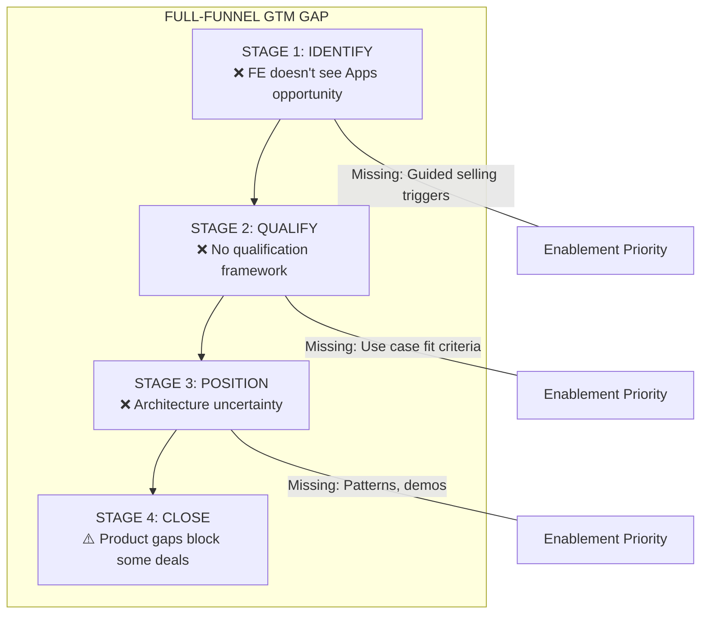

# Field Enablement

*Owner: Enablement Team / Adoption Architect*

---

## Current State Assessment

| Capability | Readiness |
|------------|-----------|
| Data Engineering conversations | ✅ Ready |
| Data Modeling conversations | ✅ Ready |
| Governance conversations | ✅ Ready |
| **Backend app design patterns** | ❌ Not Ready |
| **Frontend app design patterns** | ❌ Not Ready |
| **App architecture best practices** | ❌ Not Ready |

### The Gap

**Databricks Field Engineering is equipped to handle Data Engineering, Modeling, and Governance conversations but isn't readily equipped to handle application (backend and frontend) design patterns and best practices conversations.**

---

## Full-Funnel GTM Gap

FE faces a full-funnel gap—not just architecture skills:



---

## 90-Day Training Sprint

| Topic | Priority | Format | Owner | Timeline |
|-------|----------|--------|-------|----------|
| Security/governance patterns | 🔴 High | Playbook + workshop | Adoption Architect | Week 1-4 |
| App discovery workshop | 🔴 High | Interactive workshop | AA + Enablement | Week 5-8 |
| Competitive talk track | 🔴 High | One-pager + role-play | Adoption Architect | Week 9-12 |
| Reference architectures | 🟡 Medium | Documentation | Adoption Architect | Month 4-5 |
| Cost/scaling guidance | 🟡 Medium | FAQ + decision tree | AA + PM | Month 5-6 |

### Enablement Sequencing

```
Week 1-4:   Security/governance patterns (regulated verticals first)
Week 5-8:   App discovery workshop (all verticals)
Week 9-12:  Competitive talk track (all verticals)
Ongoing:    Reference architectures, cost guidance (as product matures)
```

---

## Current Enablement Assets

| Asset | Coverage | Gap |
|-------|----------|-----|
| **Apps Cookbook** | Simple examples only | Does not show "what good looks like" |
| **Architecture guidance** | Limited | No reference architectures |
| **Demo assets** | Basic | No industry-specific demos |

---

## Priority Training Content

### 1. Security/Governance Patterns

| Topic | Content | For Whom |
|-------|---------|----------|
| Credential passthrough | How Unity Catalog auth works with Apps | All FE |
| AuthN/AuthZ patterns | Authentication and authorization flows | FSI, HLS |
| Data access controls | Applying governance to app data access | FSI, HLS |
| Compliance patterns | Meeting regulatory requirements | FSI, HLS |

### 2. App Discovery Workshop

A structured workshop to help customers identify Apps opportunities:

| Phase | Duration | Activities |
|-------|----------|------------|
| **Landscape** | 30 min | Map existing apps and pain points |
| **Opportunity** | 45 min | Identify cockpit/vertical/horizontal fits |
| **Qualification** | 30 min | Apply fit assessment questions |
| **Prioritization** | 15 min | Rank opportunities by value and feasibility |

### 3. Competitive Talk Track

| Competitor | Key Message | Proof Points Needed |
|------------|-------------|---------------------|
| **Palantir** | Open platform, better economics | TCO comparison, no lock-in |
| **Hyperscalers** | Data+AI integration, unified governance | Time-to-value, governance story |
| **Snowflake** | Full AI platform vs. analytics-only | AI/ML depth, model serving |

---

## Marketing Events Strategy

### Why Events Matter for Apps

- Executives need to see Apps in action to say "I want that!"
- Field needs demos to reference in customer conversations
- Marketing events drive awareness and create demand

### Event Calendar for Apps Visibility

| Event | Timing | Target Demo | Owner | Status |
|-------|--------|-------------|-------|--------|
| **NRF (National Retail Federation)** | Jan | Retail cockpit: Inventory visibility | Marketing + Retail Lead | ⬜ TBD |
| **HIMSS (Healthcare)** | Mar | HLS cockpit: Clinical operations | Marketing + HLS Lead | ⬜ TBD |
| **Data+AI Summit** | Jun | Flagship Apps demo (multi-archetype) | Marketing | ⬜ TBD |
| **Data+AI World Tours** | Ongoing | Regional Apps demos by vertical | Field Marketing | ⬜ TBD |
| **AWS re:Invent** | Nov | Apps vs hyperscaler positioning | Marketing | ⬜ TBD |

---

## EBC (Executive Briefing Center) Strategy

### Why EBCs Matter

- Strategic customers visit EBCs for executive-level engagement
- Executives make platform decisions in EBCs
- "I want that!" moments drive Apps adoption from the top

### EBC Apps Coverage Standard

| Element | Description | Owner |
|---------|-------------|-------|
| **Apps Positioning Slot** | 15-30 min segment on Apps in every EBC | EBC Team + AA |
| **Live Demo** | Interactive Apps demo tailored to customer vertical | Industry Lead |
| **Business Value Story** | ROI narrative, not just technical | AA |
| **Customer Proof Point** | Reference customer in same vertical | AA |

### EBC Demo by Vertical

| Vertical | Demo | Key Message |
|----------|------|-------------|
| **Retail** | Inventory visibility cockpit | "Real-time business visibility" |
| **FSI** | Risk dashboard with ML | "AI-powered decision making" |
| **HLS** | Clinical operations app | "Data-driven care coordination" |
| **MFG** | Supply chain cockpit | "End-to-end visibility" |
| **DN** | Platform productivity app | "Democratize data access" |

---

## "Month of Apps" Hackathon Program

### Proven Model

**Initiative:** Retail, Travel, Consumer Goods "Month of Apps"
**Initiated by:** Adoption Architect
**Format:** Exec-sponsored internal hackathon
**Duration:** 1 month

### Hackathon Playbook

1. **Exec Sponsorship:** Secure VP/SVP support for the initiative
2. **Theme:** Focus on industry-specific Apps use cases
3. **Participation:** FE teams, SAs, Industry specialists
4. **Deliverables:** Working App First Demos for the vertical
5. **Showcase:** Present outcomes to field and customers
6. **Outcomes:** [TBD - Document results]

### Replication Plan

- Q1: Document playbook from Retail/Travel/CG initiative
- Q2: Launch in FSI and HLS
- Q3: Launch in MFG and DN
- Ongoing: Refresh demos annually

---

## Actions for Enablement Team

| Action | Purpose | Priority | Timeline |
|--------|---------|----------|----------|
| Create security patterns playbook | Address #1 FE concern | High | Month 1 |
| Design app discovery workshop | Structured opportunity identification | High | Month 1-2 |
| Develop competitive talk tracks | Counter Palantir, hyperscalers | High | Month 2 |
| Build reference architectures | Show "what good looks like" | Medium | Month 4-5 |
| Create cost/scaling guidance | Set customer expectations | Medium | Month 5-6 |
| Document hackathon playbook | Enable replication | High | Month 2 |

---

*Last Updated: January 2026*

**Related:** [Sales Plays](03_sales_plays_and_patterns.md) | [Signal Capture](07_signal_capture.md) | [Hypotheses H3](../30_framework/01_hypotheses_and_beliefs.md#h3)

