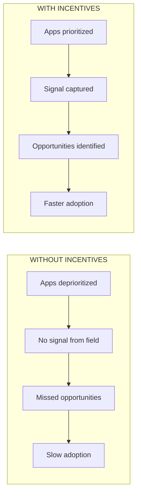
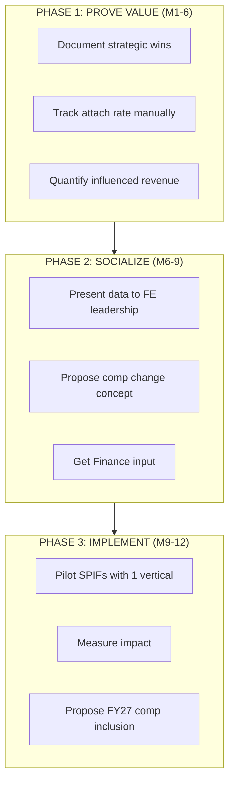

# Field Incentives

*Owner: Sales Operations / Field Leadership*

---

## The Incentive Problem

**Current State:** Field has no financial incentive to prioritize Apps.

| Dimension | Status |
|-----------|--------|
| Apps attach rate in comp | ❌ Not included |
| Influenced revenue recognition | ❌ Not tracked |
| Apps-specific SPIFs | ❌ None |
| Apps opportunity tracking | ⚠️ Partial |

**Result:** Field focuses on core products; Apps is de-prioritized.

---

## Why Incentives Matter

---

## Incentive Framework

### Tier 1: Recognition (Low Cost, Immediate Impact)

| Mechanism | Description | Owner |
|-----------|-------------|-------|
| **Apps Champion Program** | Public recognition for Apps wins | AA |
| **Win Story Spotlight** | Feature Apps wins in newsletters | AA |
| **Leaderboard** | Track Apps opportunities by FE | Sales Ops |
| **Exec Shout-outs** | VP/SVP recognition for strategic wins | FE Leadership |

### Tier 2: Development (Medium Cost, Medium-term)

| Mechanism | Description | Owner |
|-----------|-------------|-------|
| **Apps Certification** | Technical certification for app patterns | Enablement |
| **Expert Badge** | Visible designation for Apps experts | Enablement |
| **Conference Speaking** | Data+AI Summit speaking slots for Apps wins | Marketing |
| **Customer References** | Named on customer case studies | AA + Marketing |

### Tier 3: Financial (Higher Cost, Longer-term)

| Mechanism | Description | Owner |
|-----------|-------------|-------|
| **Apps SPIFs** | Spot bonuses for Apps-led deals | Sales Ops |
| **Attach Rate Bonus** | Comp modifier for Apps attach | FE Leadership |
| **Influenced Revenue Credit** | Partial credit for downstream expansion | Finance |
| **Team Incentives** | Pod/team bonuses for Apps coverage | Sales Ops |

---

## Signal Capture Incentives

**Problem:** We need field to provide meaningful feedback on Apps opportunities, blockers, and product gaps.

### Incentives for Signal Capture

| Signal Type | Incentive | Mechanism |
|-------------|-----------|-----------|
| **Opportunity Identification** | Apps Champion points | Track in SFDC |
| **Product Gap Reporting** | Recognition in PM feedback | Weekly summary |
| **Loss Analysis** | No penalty; constructive feedback | Safe environment |
| **Use Case Documentation** | Featured in playbooks | Named attribution |
| **Customer Quotes** | Case study credit | Marketing recognition |

### Making Signal Capture Easy

| Barrier | Solution |
|---------|----------|
| Too much effort | Simplified SFDC fields |
| No feedback loop | Weekly signal summary to field |
| No visible impact | "Your feedback influenced X feature" |
| Time pressure | 5-minute signal capture form |

---

## Influence Strategy for Comp Changes

Since comp plan changes require executive buy-in and Finance approval, here's the influence path:

---

## Quick Wins (Next 90 Days)

| Action | Impact | Effort | Owner |
|--------|--------|--------|-------|
| Launch Apps Champion program | Medium | Low | AA |
| Create Apps leaderboard | Medium | Low | Sales Ops |
| Feature Apps wins in BU newsletter | Medium | Low | AA |
| Exec shout-outs for strategic wins | High | Low | FE Leadership |
| Simplified signal capture form | High | Medium | Sales Ops + AA |

---

## Success Metrics

| Metric | Baseline | Target (6 mo) |
|--------|----------|---------------|
| Apps opportunities logged in SFDC | TBD | +50% |
| Field signal submissions per month | TBD | 10+ |
| Apps mentioned in FE conversations | TBD | +30% |
| Apps Champion program participation | 0 | 15+ |

---

## Dependencies

| Dependency | Owner | Status |
|------------|-------|--------|
| SFDC Apps opportunity field | Sales Ops | ⬜ TBD |
| Signal capture form | Sales Ops + AA | ⬜ TBD |
| Attach rate tracking | Analytics | ⬜ TBD |
| Influenced revenue methodology | Finance | ⬜ TBD |

---

*Last Updated: January 2026*

**Related:** [Signal Capture](07_signal_capture.md) | [Hypotheses H6](../30_framework/01_hypotheses_and_beliefs.md#h6)

