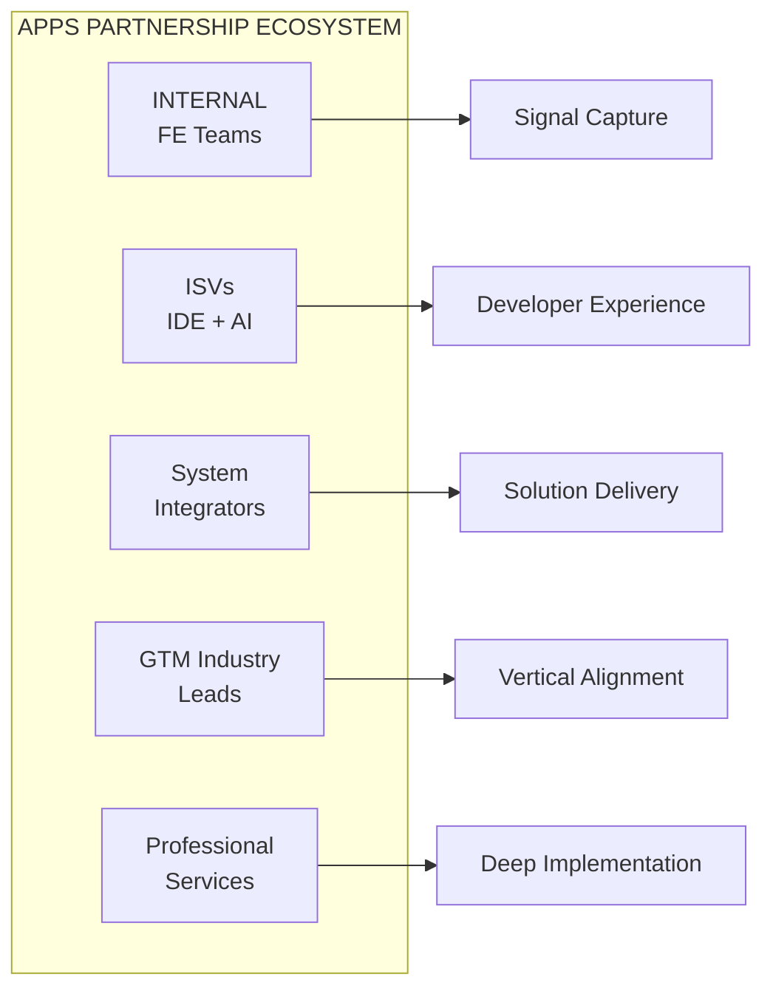
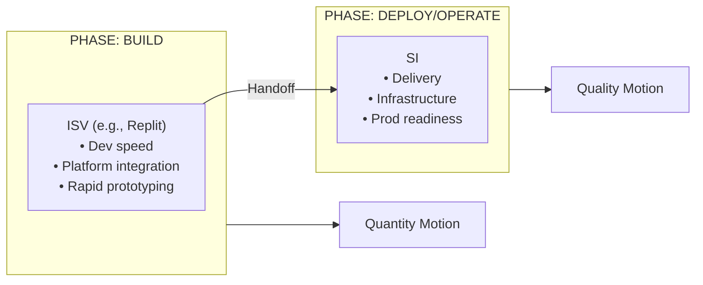

# Partner Ecosystem

*Owner: Partner Team / Adoption Architect*

---

## Partnership Strategy Overview

Five partnership categories are critical to scaling Apps adoption:

---

## Partner Type 1: Internal FE Teams

### Role
Field Engineering teams (especially EPLs) serve as the front line for:
- **Signal capture** from customer conversations
- **Pattern identification** across accounts
- **Early warning** on adoption blockers
- **Feedback loop** to Product and Adoption Architect

### Current State

| Dimension | Status |
|-----------|--------|
| Data/ML expertise | ✅ Strong |
| App development expertise | ❌ Gap |
| Signal capture process | ❓ Unknown |
| Feedback mechanisms | ❓ Unknown |

### Actions Needed

| Action | Purpose | Priority |
|--------|---------|----------|
| Enable FEs on app patterns | Close expertise gap | High |
| Create signal capture process | Systematic friction identification | High |
| Establish feedback cadence | Regular input to playbooks | Medium |
| Identify Apps champions in FE | Build internal advocates | Medium |

---

## Partner Type 2: ISVs (Independent Software Vendors)

### Strategic Goal
Win **developer mindshare** by making Databricks the preferred platform for data-intensive application development.

### IDE Experiences (Critical for Quantity Motion)

| Partner | Opportunity |
|---------|-------------|
| **Cursor** | AI-assisted Databricks development |
| **Windsurf** | Modern IDE with Databricks integration |
| **Vercel** | Frontend deployment + Databricks backend |
| **Replit** | Rapid prototyping, platform integration |

**Strategic Play:** Coding agents should easily integrate with Databricks and understand its services → Create an **opinionated, data-oriented IDE experience**.

**Link to Quantity Motion:**
- IDE experience is **critical for Digital Native customers**
- Developer mindshare governs adoption in tech-forward accounts
- Many lightweight apps require frictionless creation experience

### AI/ML ISVs

| Partner Type | Opportunity |
|--------------|-------------|
| Vector DB providers | Integrate with Lakebase |
| LLM frameworks | LangChain, LlamaIndex integrations |
| Agent platforms | Native Databricks agent building |

### Actions Needed

| Action | Purpose | Priority |
|--------|---------|----------|
| Identify target IDE partners | Developer experience focus | High |
| Create Databricks SDK for IDEs | Enable seamless development | High |
| Develop partner certification | Quality control for Apps | Medium |

---

## Partner Type 3: System Integrators (SIs)

### Strategic Goal
Partner with SIs who lead with an **App-first GTM motion** to scale solution delivery.

### Ideal SI Partner Profile

| Dimension | Criteria |
|-----------|----------|
| **GTM Motion** | Leads with applications, not infrastructure |
| **Industry Focus** | Deep vertical expertise |
| **Databricks Expertise** | Existing partnership or willingness to invest |
| **Delivery Model** | Can build and operationalize Apps |

### Competitive Dynamic: Palantir's FDE Motion

**Palantir's Advantage:**
- Deploys engineers directly with customers
- Creates deep, solution-oriented relationships
- Expensive but effective for land-and-expand

**Counter-Strategy via SI Partners:**
- SIs can provide FDE-like engagement
- More scalable than internal FDE build-out
- Leverage SI industry expertise
- Lower cost than Palantir's model

### ISV + SI Complementary Model

ISVs and SIs scale adoption differently but work together as a **complementary motion**:

### Actions Needed

| Action | Purpose | Priority |
|--------|---------|----------|
| Identify App-first SIs | Find partners with right GTM motion | High |
| Create SI enablement program | Train on Apps architecture | High |
| Develop joint solution accelerators | Speed time-to-value | Medium |
| Establish co-sell motions | Align incentives | Medium |

---

## Partner Type 4: GTM Industry Leads

### Strategic Goal
Align with **GTM Industry Leads** to identify key Apps use cases by vertical and drive industry-specific adoption momentum.

### Why Industry Leads Matter
- FE doesn't see Apps opportunities without vertical context
- Use cases vary significantly by industry
- Industry leads control event presence, EBC content, field priorities
- Execs need industry-relevant "I want that!" moments

### Industry Lead Alignment Matrix

| Industry | Lead | Use Cases by Archetype | App First Demo | Status |
|----------|------|------------------------|----------------|--------|
| **Retail** | TBD | Cockpit: Inventory visibility, Vertical: Demand sensing | [Link: TBD] | Not aligned |
| **FSI** | TBD | Cockpit: Risk dashboard, Vertical: Fraud detection | [Link: TBD] | Not aligned |
| **HLS** | TBD | Cockpit: Clinical ops, Vertical: Trial optimization | [Link: TBD] | Not aligned |
| **MFG** | TBD | Cockpit: Supply chain, Vertical: Quality prediction | [Link: TBD] | Not aligned |
| **DN** | TBD | Horizontal: Platform tools, AI apps | [Link: TBD] | Not aligned |

### Industry Lead Responsibilities

| Responsibility | Description | Deliverable |
|----------------|-------------|-------------|
| **Use Case Definition** | Identify key Apps use cases by archetype for their vertical | Use case catalog |
| **App First Demos** | Encourage and sponsor creation of industry-specific demos | Demo links |
| **Event Presence** | Ensure Apps demos at industry events (NRF, HIMSS, etc.) | Event calendar |
| **EBC Coverage** | Include Apps positioning in strategic customer EBCs | EBC agenda |
| **Internal Hackathons** | Champion exec-sponsored "Month of Apps" initiatives | Hackathon outcomes |

### Actions Needed

| Action | Purpose | Priority |
|--------|---------|----------|
| Align with 5 industry leads on Apps use cases | Define vertical-specific opportunities | High |
| Create App First Demo repository | Centralize demo assets by industry | High |
| Document "Month of Apps" playbook | Enable replication across verticals | High |
| Establish EBC Apps coverage standard | Ensure exec visibility | Medium |

---

## Partner Type 5: Professional Services (Internal)

### Strategic Goal
Engage Professional Services to enable **deep implementations** for business outcome-oriented customers (Quality motion).

### Why PS Matters for Apps

| Dimension | Without PS | With PS |
|-----------|-----------|---------|
| **Implementation Depth** | Shallow, often abandoned | Deep, production-grade |
| **Business Value** | Unclear, technical focus | Tied to outcomes |
| **Retention** | Low | High |
| **Stickiness** | Low | High |

### When to Engage PS

| Customer Profile | Engage PS? | Why |
|------------------|------------|-----|
| Business outcome-oriented | ✅ Yes | Need depth to prove value |
| Enterprise, Regulated (FSI, HLS) | ✅ Yes | Compliance requires depth |
| Few developers, business sponsor | ✅ Yes | Need hands-on support |
| Strategic lighthouse account | ✅ Yes | Win must be bulletproof |
| Digital Native, many developers | ❌ No | Self-serve, dev experience focus |

### PS Engagement Model

| Phase | PS Role | Deliverable |
|-------|---------|-------------|
| **Discovery** | Business value workshop | Use case prioritization |
| **Design** | Architecture review | Reference architecture |
| **Build** | Hands-on implementation | Production app |
| **Launch** | Go-live support | Operational readiness |
| **Optimize** | Performance tuning | Retention checkpoint |

### Actions Needed

| Action | Purpose | Priority |
|--------|---------|----------|
| Align with PS leadership on Apps capacity | Ensure PS availability for Quality motion | High |
| Create PS enablement on Apps patterns | Build PS capability | High |
| Define PS engagement criteria for Apps | Clarify when to engage PS | Medium |
| Track PS engagement → retention correlation | Validate hypothesis | Medium |

---

## Partnership Prioritization Matrix

| Partner Type | 3-Month Focus | 6-Month Focus | 12-Month Focus |
|--------------|---------------|---------------|----------------|
| **FE Teams** | Signal capture process | Enablement at scale | Apps champions network |
| **ISVs** | IDE partnership exploration | SDK development | Ecosystem showcase |
| **SIs** | Identify 2-3 strategic partners | Joint enablement | Co-sell at scale |
| **Industry Leads** | Align on use cases | Launch hackathons | Full vertical coverage |
| **Professional Services** | PS alignment, lighthouse | PS capacity planning | PS-lite model for scale |

---

## Partnership Success Metrics

| Metric | Definition | Target |
|--------|------------|--------|
| **FE Apps Conversations** | # of Apps-related customer conversations | TBD |
| **ISV Integrations** | # of IDE/tool integrations live | TBD |
| **SI-Sourced Pipeline** | Pipeline from SI-led opportunities | TBD |
| **SI-Delivered Apps** | # of production Apps built by SIs | TBD |
| **Developer Adoption** | # of developers building on Databricks Apps | TBD |

---

*Last Updated: January 2026*

**Related:** [Field Enablement](04_field_enablement.md) | [ICP and Targeting](01_icp_and_targeting.md) | [Hypotheses H5, H8](../30_framework/01_hypotheses_and_beliefs.md)

