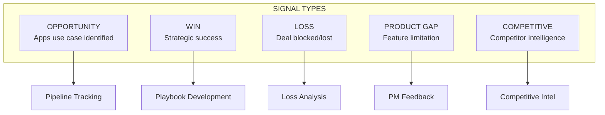
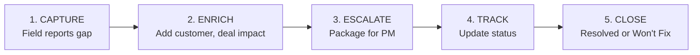

# Signal Capture

*Owner: Adoption Architect / Sales Ops*

---

## Why Signal Capture Matters

Adoption signals and blockers are fragmented across accounts and teams. Systematic capture enables:
- **Prioritized PM feedback** with quantified impact
- **Loss analysis** to prevent repeated failures
- **Pattern identification** for playbook development
- **Influence** over product roadmap

---

## Signal Types

---

## Field Signal Log

*Systematic capture of field feedback for PM influence and loss analysis.*

### Active Signal Log Template

| Date | Source | Category | Gap | Use Case Blocked | Customer | Lost Deal? | PM Ticket | Status |
|------|--------|----------|-----|------------------|----------|------------|-----------|--------|
| | | | | | | | | |

### Signal Status Values

| Status | Meaning |
|--------|---------|
| **New** | Just captured, not yet enriched |
| **Enriched** | Customer + deal impact documented |
| **Escalated** | Shared with PM |
| **Acknowledged** | PM accepted feedback |
| **Roadmap** | PM committed to address |
| **Shipped** | Gap resolved in product |
| **Won't Fix** | PM declined; document workaround |

---

## Signal Capture Process

### Process Details

1. **Capture:** When field reports a gap, add row to signal log
2. **Enrich:** Work with account team to get customer name, deal impact
3. **Escalate:** Package into weekly PM feedback (Apps Adoption Council)
4. **Track:** Update status as PM responds
5. **Close:** Remove from active log when resolved

---

## Known Product Gaps (Field Signal: Jan 2026)

| Category | Gap | Use Case Blocked | Source |
|----------|-----|------------------|--------|
| **Security** | No public URLs without login | External-facing apps | Field SA |
| **Security** | No firewall | Internet-exposed apps | Field SA |
| **Security** | No ingress/egress controls | FSI/HLS compliance | Field SA |
| **Security** | CVE protection unclear | Enterprise security review | Field SA |
| **Scaling** | Vertical only | High-traffic apps | Field SA |
| **Scaling** | No horizontal scaling | Distributed architectures | Field SA |
| **Cost** | Fixed 24x7 pricing | Cost-sensitive deals | Field SA |
| **Customization** | No GPU config | AI inference apps | Field SA |
| **Customization** | Complex model serving | ML-powered apps | Field SA |
| **Database** | Lakebase only | Hybrid OLTP apps | Field SA |
| **Domains** | No custom domains | Branded apps | Field SA |
| **Observability** | No user sessions | All apps | Field SA |

---

## Loss Analysis Framework

### Loss Analysis Template

For each blocked deal, document:

| Field | Description |
|-------|-------------|
| **Customer** | Account name |
| **Use Case** | What they wanted to build |
| **Archetype** | Cockpit / Vertical / Horizontal |
| **Blocker** | Specific product gap or competitive loss |
| **Competitor Chosen** | Who won, if competitive |
| **Revenue Impact** | ACV lost or at risk |
| **Recoverable?** | Yes (when gap fixed) / No |
| **Lessons** | What we learned |

### Monthly Loss Summary

| Month | Deals Lost | Primary Gap | Total ACV Impact | Notes |
|-------|------------|-------------|------------------|-------|
| Jan 2026 | TBD | TBD | TBD | Initial baseline |

---

## PM Feedback Synthesis

### Weekly Feedback Format

| Section | Content |
|---------|---------|
| **Top 3 Blockers This Week** | Most impactful gaps reported |
| **Customer Attribution** | Which customers affected |
| **Deal Impact** | Revenue at risk or lost |
| **Recommended Priority** | Suggested PM action order |
| **Signal Count** | Number of reports per gap |

### Gap Prioritization for PM

| Priority | Gap Cluster | Deal Impact | Action |
|----------|-------------|-------------|--------|
| **1** | Security (public apps, firewall, ingress/egress) | Blocks regulated industries | Escalate to PM immediately |
| **2** | Cost (fixed pricing) | Objection in every deal | Include in PM feedback cycle |
| **3** | Scaling (horizontal) | Limits architecture patterns | Track loss analysis |
| **4** | Observability | Post-deployment friction | Lower priority |

---

## Question Framework (Discovery)

### Questions for Customer Understanding

#### Team & Resources
- Are you a team of 1, or do you have direct/dotted-line resources?
- What budget do you control for enablement, tooling, or programs?
- Are you building from scratch or inheriting existing infrastructure?

#### Stakeholder Map
- Who do you report to? (Product? GTM? Dual?)
- Which BU+1s are in initial scope?
- Do you have existing champions in Field, Product, or Sales leadership?

#### Adoption Infrastructure
- Is there existing adoption telemetry or dashboards for Apps?
- Where does adoption signal currently live?
- Any existing playbooks or enablement materials?

---

## Operating Cadence for Signal Capture

| Forum | Frequency | Signal Activity |
|-------|-----------|-----------------|
| Apps Adoption Council | Weekly | Review new signals, prioritize PM feedback |
| BU+1 Newsletter | Monthly | Summarize signal trends |
| PM Feedback Synthesis | Weekly | Package top blockers |
| Loss Analysis Review | Monthly | Deep dive on losses |

---

## Actions for Adoption Architect

| Action | Purpose | Priority |
|--------|---------|----------|
| Launch signal capture process | Systematic feedback collection | High |
| Create simplified capture form | Remove friction for field | High |
| Establish weekly PM synthesis | Influence product roadmap | High |
| Build loss analysis dashboard | Quantify impact | Medium |
| Document gap resolution path | Close the loop with field | Medium |

---

## Success Metrics

| Metric | Baseline | Target (6 mo) |
|--------|----------|---------------|
| Signals captured per week | 0 | 10+ |
| PM features influenced | 0 | 2+ |
| Average signal-to-escalation time | N/A | <7 days |
| Field NPS on signal process | N/A | >7 |

---

*Last Updated: January 2026*

**Related:** [Friction Summary](../20_product/03_friction_summary.md) | [Loss Analysis](../20_product/04_loss_analysis.md) | [Field Incentives](05_field_incentives.md)

