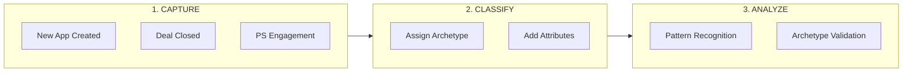

# Use Case Tracking

*Owner: Product Management / Analytics*

---

## Purpose

Track actual use cases in the wild to:
- **Validate archetypes** (Cockpit, Vertical, Horizontal)
- **Identify emerging patterns** not yet classified
- **Prioritize product investment** based on real usage
- **Inform GTM messaging** with customer evidence

---

## Use Case Classification Framework

### Primary Archetypes

| Archetype | Definition | Key Signals |
|-----------|------------|-------------|
| **Business Cockpit** | Executive/business visibility app | Dashboard, analytics, predictions |
| **Deep Vertical** | Industry-specific solution | Domain expertise, proprietary data |
| **Horizontal** | Platform productivity tool | Data quality, catalog, self-serve |

### Secondary Attributes

| Attribute | Options |
|-----------|---------|
| **Traffic Pattern** | Always-on / Burst / Periodic |
| **User Type** | Executive / Analyst / Developer / Business |
| **AI Integration** | None / Predictive / Generative / Agentic |
| **Data Source** | Lakehouse-native / External / Hybrid |
| **Exposure** | Internal / Partner / Public |

---

## Tracking Mechanism

### Data Sources

| Source | What It Captures |
|--------|------------------|
| **Product Telemetry** | App creation, usage, features used |
| **SFDC Opportunity** | Deal context, customer, value |
| **Field Signal Log** | Qualitative insights, blockers |
| **PS Engagements** | Deep implementation details |

### Classification Process

---

## Use Case Registry

### Registry Template

| Field | Description |
|-------|-------------|
| **Use Case ID** | Unique identifier |
| **Customer** | Account name |
| **Industry** | Vertical |
| **Archetype** | Cockpit / Vertical / Horizontal |
| **Description** | What the app does |
| **AI Integration** | Type of AI used |
| **Traffic Pattern** | Usage characteristics |
| **Databricks Features** | Unity Catalog, Lakebase, etc. |
| **Business Value** | Quantified impact |
| **Status** | POC / Production / Churned |

### Sample Registry

| ID | Customer | Industry | Archetype | Description | AI | Status |
|----|----------|----------|-----------|-------------|-----|--------|
| UC001 | [TBD] | Retail | Cockpit | Inventory visibility dashboard | Predictive | TBD |
| UC002 | [TBD] | FSI | Vertical | Fraud detection app | ML | TBD |
| UC003 | [TBD] | DN | Horizontal | Data quality tool | None | TBD |

---

## Archetype Validation

### Hypothesis to Test

> **H4:** Three App Archetypes (Cockpit, Vertical, Horizontal) drive 80% of successful adoption.

### Validation Criteria

| Metric | Source | Target |
|--------|--------|--------|
| % of apps classifiable into 3 archetypes | Registry | 80%+ |
| Revenue distribution by archetype | SFDC | Measurable split |
| Win rate by archetype | SFDC | Comparable or better |
| Retention by archetype | Telemetry | Track patterns |

### Quarterly Review

| Quarter | Total Apps | Cockpit | Vertical | Horizontal | Other | % in 3 Archetypes |
|---------|-----------|---------|----------|------------|-------|-------------------|
| Q1 FY26 | TBD | TBD | TBD | TBD | TBD | TBD |

---

## Emerging Pattern Detection

### Signals for New Archetypes

| Signal | Action |
|--------|--------|
| Cluster of "Other" use cases | Analyze for common pattern |
| Repeated field feedback | Investigate as potential archetype |
| Competitive loss pattern | Check if new archetype needed |

### New Pattern Template

| Field | Description |
|-------|-------------|
| **Pattern Name** | Proposed archetype name |
| **Definition** | What characterizes this pattern |
| **Example Use Cases** | 3+ examples |
| **Customer Profile** | Who builds these |
| **Databricks Fit** | How we differentiate |
| **Recommendation** | Add as archetype? Merge? Ignore? |

---

## Actions for Product Management

| Action | Purpose | Priority |
|--------|---------|----------|
| Establish use case registry | Systematic tracking | High |
| Tag top 20 customers by archetype | Initial classification | High |
| Build quarterly review cadence | Ongoing validation | Medium |
| Create telemetry for archetype signals | Automated classification | Medium |

---

## Success Metrics

| Metric | Baseline | Target (6 mo) |
|--------|----------|---------------|
| Use cases in registry | 0 | 50+ |
| Classification accuracy | N/A | 90%+ |
| Archetype validation (H4) | Untested | Validated/Invalidated |
| New patterns identified | 0 | 1-2 |

---

*Last Updated: January 2026*

**Related:** [Sales Plays](../10_field/03_sales_plays_and_patterns.md) | [Hypotheses H4](../30_framework/01_hypotheses_and_beliefs.md#h4)

