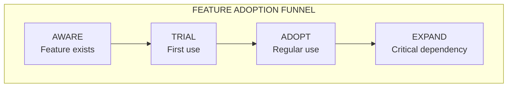

# Feature Adoption Roadmap

*Owner: Product Management*

---

## Purpose

Track which features drive:
- **Revenue (DBUs)** - Direct monetization
- **Satisfaction (CSAT)** - Customer happiness
- **Adoption** - Usage breadth and depth
- **Retention** - Long-term stickiness

---

## Feature Categories

### Core Platform Features

| Feature | Category | Description |
|---------|----------|-------------|
| **App Hosting** | Infrastructure | Run apps on Databricks |
| **App Spaces** | Infrastructure | Group related apps |
| **Lakebase Integration** | Data | Operational data store |
| **Unity Catalog** | Governance | Auth, lineage, security |
| **Model Serving** | AI/ML | Serve ML models in apps |
| **AI Agents** | AI/ML | Agentic app capabilities |

### Developer Experience Features

| Feature | Category | Description |
|---------|----------|-------------|
| **Python Framework** | Dev | Python app development |
| **Streamlit Support** | Dev | Streamlit app deployment |
| **Gradio Support** | Dev | Gradio app deployment |
| **IDE Integration** | Dev | External IDE support |
| **Debugging Tools** | Dev | App debugging capabilities |

---

## Feature Adoption Metrics

### DBU Impact by Feature

| Feature | DBU Contribution | Trend | Notes |
|---------|------------------|-------|-------|
| App Hosting | TBD | TBD | Base platform |
| Lakebase | TBD | TBD | Operational data |
| Model Serving | TBD | TBD | AI apps |
| Unity Catalog | TBD | TBD | Governance |
| App Spaces | TBD | TBD | New feature |

### CSAT by Feature

| Feature | CSAT Score | Sample Size | Top Feedback |
|---------|------------|-------------|--------------|
| App Hosting | TBD | TBD | TBD |
| Lakebase | TBD | TBD | TBD |
| Model Serving | TBD | TBD | TBD |
| Developer Tools | TBD | TBD | TBD |

### Adoption by Feature

| Feature | Accounts Using | % of Total Apps | Growth Rate |
|---------|----------------|-----------------|-------------|
| Python Framework | TBD | TBD | TBD |
| Streamlit | TBD | TBD | TBD |
| Lakebase | TBD | TBD | TBD |
| Unity Catalog | TBD | TBD | TBD |
| Model Serving | TBD | TBD | TBD |

---

## Product Roadmap Influence

### Current Roadmap (from Product Context)

| Timeline | Initiative | Expected Impact |
|----------|------------|-----------------|
| **FY26** | App Spaces | Improved cost efficiency |
| **FY26** | Cost Efficiency | Better resource management |
| **FY27** | Legacy Framework Support | Java/.NET migration |
| **FY27** | Fully Featured Apps | Platform parity |

### Field-Requested Features

| Feature Request | Field Signal Count | Deal Impact | PM Status |
|-----------------|-------------------|-------------|-----------|
| Horizontal scaling | TBD | TBD | TBD |
| Public URL support | TBD | TBD | TBD |
| Cost controls | TBD | TBD | TBD |
| Custom domains | TBD | TBD | TBD |
| GPU config | TBD | TBD | TBD |

---

## Feature-to-Archetype Matrix

| Feature | Cockpit | Vertical | Horizontal |
|---------|:-------:|:--------:|:----------:|
| Lakebase | ✅ | ✅ | |
| Unity Catalog | ✅ | ✅ | ✅ |
| Model Serving | | ✅ | |
| AI Agents | | ✅ | ✅ |
| Streamlit | ✅ | | ✅ |
| Python Framework | ✅ | ✅ | ✅ |

---

## Adoption Funnel by Feature

### Funnel Metrics

| Feature | Aware | Trial | Adopt | Expand |
|---------|-------|-------|-------|--------|
| Lakebase | TBD% | TBD% | TBD% | TBD% |
| Model Serving | TBD% | TBD% | TBD% | TBD% |
| App Spaces | TBD% | TBD% | TBD% | TBD% |

---

## Actions for Product Management

| Action | Purpose | Priority |
|--------|---------|----------|
| Instrument feature usage telemetry | Track adoption | High |
| Establish CSAT collection by feature | Measure satisfaction | High |
| Map field requests to roadmap | Influence prioritization | High |
| Create feature adoption dashboard | Visibility | Medium |

---

## Success Metrics

| Metric | Baseline | Target (6 mo) |
|--------|----------|---------------|
| Features with DBU tracking | 0 | All core |
| Features with CSAT tracking | 0 | Top 5 |
| Field requests with roadmap mapping | 0 | 100% |
| Adoption funnel visibility | None | Full funnel |

---

*Last Updated: January 2026*

**Related:** [Friction Summary](03_friction_summary.md) | [Signal Capture](../10_field/07_signal_capture.md)

