# Friction Summary

*Owner: Product Management / Adoption Architect*

---

## Product Limitations Overview

### High-Level Limitations

| Limitation | Impact | Expected Resolution |
|------------|--------|---------------------|
| **Legacy App Support** | Cannot migrate Java/.NET enterprise apps | FY27 (next year) |
| **Cost Control** | No fine-grained cost management | In development |
| **Scalability** | Not yet "infinite" like hyperscalers | In development |

---

## Detailed Gap Inventory (Field Signal: Jan 2026)

| Category | Gap | Impact | Use Case Blocked | Source | Priority |
|----------|-----|--------|------------------|--------|----------|
| **Scaling** | Vertical scaling only | Can't handle burst workloads | High-traffic apps | Field SA | 🔴 Critical |
| **Scaling** | No horizontal scaling | Limits distributed app patterns | Multi-instance apps | Field SA | 🔴 Critical |
| **Customization** | No GPU/custom hardware config | Can't run GPU-intensive workloads | AI inference apps | Field SA | 🟡 Important |
| **Customization** | Needs configuration guides | Developers unsure how to optimize | All | Field SA | 🟡 Important |
| **Model Serving** | Complex standard model deployment | Friction for ML-powered apps | AI apps | Field SA | 🟡 Important |
| **Database** | Lakebase only, no external DB | Can't connect to existing OLTP | Hybrid apps | Field SA | 🟡 Important |
| **Domains** | No custom domains/vanity URLs | Can't brand customer-facing apps | External apps | Field SA | 🔴 Critical |
| **Security** | No public URLs without Databricks login | Blocks external-facing apps | Customer portals | Field SA | 🔴 Critical |
| **Security** | No firewall for external apps | Can't safely expose to internet | Public apps | Field SA | 🔴 Critical |
| **Security** | No ingress/egress controls | Compliance blocker (regulated industries) | FSI, HLS apps | Field SA | 🔴 Critical |
| **Security** | CVE protection unclear | Security team concerns | Enterprise apps | Field SA | 🟡 Important |
| **Security** | File system security gaps | App server hardening concerns | All | Field SA | 🟡 Important |
| **Cost** | Fixed 24x7 pricing only | No pay-per-use, cost unpredictable | Cost-sensitive apps | Field SA | 🔴 Critical |
| **Observability** | No user session tracking | Can't analyze user behavior | All | Field SA | 🟡 Important |
| **Observability** | No access pattern analytics | Can't optimize app performance | All | Field SA | 🟡 Important |

---

## Gap Prioritization Matrix

```mermaid
flowchart TB
    subgraph Critical["🔴 CRITICAL - Blocks Deals"]
        C1["Security: No public URLs"]
        C2["Security: No firewall"]
        C3["Security: No ingress/egress"]
        C4["Scaling: Horizontal"]
        C5["Cost: Fixed 24x7"]
        C6["Domains: No custom URLs"]
    end
    
    subgraph Important["🟡 IMPORTANT - Friction"]
        I1["Customization: No GPU"]
        I2["Model Serving: Complex"]
        I3["Database: Lakebase only"]
        I4["Observability: User sessions"]
    end
    
    Critical --> DealLoss["Deal Loss Risk"]
    Important --> Friction["Deployment Friction"]
```

---

## Gap Priority for PM Feedback

| Priority | Gap Cluster | Deal Impact | Action |
|----------|-------------|-------------|--------|
| **1** | Security (public apps, firewall, ingress/egress) | Blocks regulated industries | Escalate to PM immediately |
| **2** | Cost (fixed pricing) | Objection in every deal | Include in PM feedback cycle |
| **3** | Scaling (horizontal) | Limits architecture patterns | Track loss analysis |
| **4** | Observability | Post-deployment friction | Lower priority |

---

## Blocker Resolution Strategy

| Blocker | Short-term (90 days) | Mid-term (6 months) |
|---------|----------------------|---------------------|
| **Scalability/Cost** | Set expectations, position for right use cases | Product delivers app spaces improvements |
| **Security/Compliance** | PM escalation + create security patterns playbook | Mandatory training for regulated verticals |
| **Architecture** | Configuration guides, model serving patterns | Full reference architectures |
| **Observability** | Document limitation, suggest workarounds | Product improvement |

---

## Current Sweet Spot (Where We Win Despite Gaps)

| Use Case Type | Why It Works | Gaps Avoided |
|---------------|--------------|--------------|
| **Internal data apps** | No external exposure needed | Security, Domains |
| **Moderate-traffic apps** | Vertical scaling sufficient | Horizontal scaling |
| **Always-on apps** | Fixed pricing acceptable | Cost controls |
| **Data-native apps** | Lakehouse data already present | External DB |
| **Authenticated users** | Databricks auth works | Public URLs |

---

## Workarounds for Common Gaps

| Gap | Workaround | Limitation |
|-----|------------|------------|
| No public URLs | Customer auth layer in front | Additional complexity |
| Fixed pricing | Position for always-on use cases | Can't serve intermittent apps |
| No GPU | Use Model Serving for inference | Separate deployment |
| No custom domains | Use internal naming | No branding |

---

## Actions for Product Management

| Action | Purpose | Priority | Timeline |
|--------|---------|----------|----------|
| Security gap escalation | Unblock regulated industries | 🔴 Critical | Immediate |
| Cost control roadmap visibility | Manage field expectations | 🔴 Critical | Month 1 |
| Horizontal scaling commitment | Unblock architecture patterns | 🟡 Important | Quarter |
| Observability roadmap | Post-deployment improvement | 🟢 Monitor | FY27 |

---

## Actions for Adoption Architect

| Action | Purpose | Priority |
|--------|---------|----------|
| Synthesize gaps into PM feedback | Influence roadmap | High |
| Create positioning for gaps | Honest messaging | High |
| Document workarounds | Enable field | High |
| Track loss analysis by gap | Quantify impact | Medium |

---

*Last Updated: January 2026*

**Related:** [Loss Analysis](04_loss_analysis.md) | [Signal Capture](../10_field/07_signal_capture.md) | [Positioning](../10_field/02_positioning_and_messaging.md)

