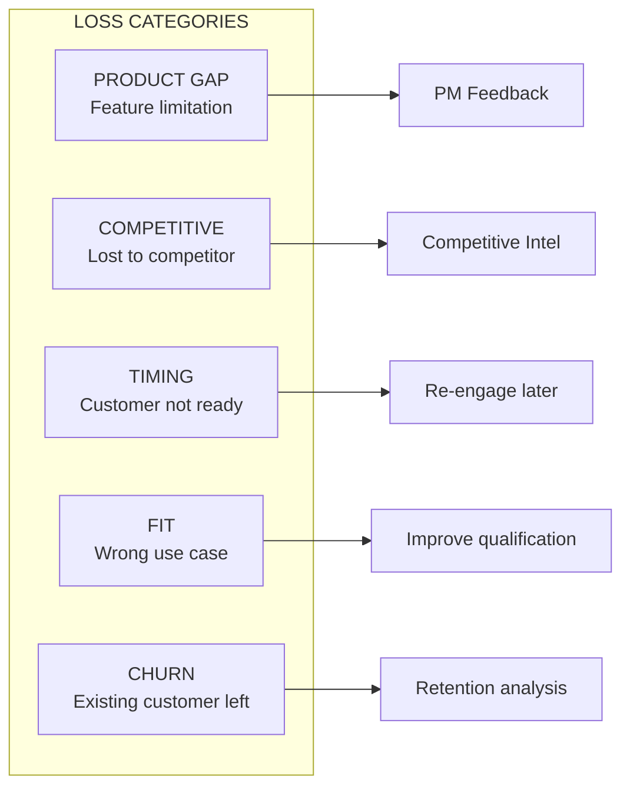
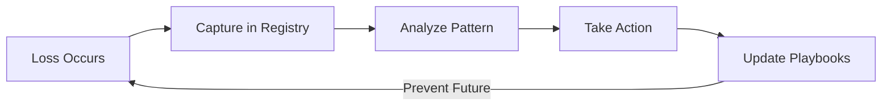

# Loss Analysis

*Owner: Adoption Architect / Sales Ops*

---

## Purpose

Systematically capture and analyze:
- **Deals lost** due to product gaps
- **Deals blocked** awaiting product improvements
- **Competitive losses** to understand positioning gaps
- **Churn** from existing Apps customers

---

## Loss Categories

---

## Loss Analysis Template

For each lost deal or blocked opportunity, capture:

| Field | Description | Required |
|-------|-------------|----------|
| **Date** | When loss occurred | Yes |
| **Customer** | Account name | Yes |
| **Use Case** | What they wanted to build | Yes |
| **Archetype** | Cockpit / Vertical / Horizontal | Yes |
| **Loss Category** | Product / Competitive / Timing / Fit / Churn | Yes |
| **Specific Blocker** | Exact gap or competitor | Yes |
| **Revenue Impact** | ACV lost or at risk | Yes |
| **Competitor** | Who won (if competitive) | If applicable |
| **Recoverable?** | Yes (when gap fixed) / No | Yes |
| **Field Signal** | Quote or context from FE | Optional |
| **Lessons** | What we learned | Yes |

---

## Loss Registry

### Active Loss Log

| Date | Customer | Use Case | Category | Blocker | ACV Impact | Competitor | Recoverable? |
|------|----------|----------|----------|---------|------------|------------|--------------|
| | | | | | | | |

### Loss by Gap (Aggregated)

| Gap | Loss Count | Total ACV | Top Competitor | Recoverable % |
|-----|------------|-----------|----------------|---------------|
| Security (public URLs) | TBD | TBD | TBD | TBD |
| Horizontal scaling | TBD | TBD | TBD | TBD |
| Cost controls | TBD | TBD | TBD | TBD |
| Custom domains | TBD | TBD | TBD | TBD |

---

## Monthly Loss Summary

| Month | Total Losses | Product Gap | Competitive | Timing | Fit | Total ACV |
|-------|--------------|-------------|-------------|--------|-----|-----------|
| Jan 2026 | TBD | TBD | TBD | TBD | TBD | TBD |

---

## Competitive Loss Analysis

### Competitor Win Analysis

| Competitor | Wins (Count) | Win Reasons | Our Gap | Counter-Strategy |
|------------|--------------|-------------|---------|------------------|
| **Hyperscalers (AWS/Azure/GCP)** | TBD | App platform maturity, scaling | Platform features | Position on data+AI integration |
| **Palantir** | TBD | FDE motion, solution depth | Engagement model | SI partnerships |
| **Snowflake** | TBD | Native apps marketplace | Ecosystem | AI/ML differentiation |

### Competitive Intelligence Capture

| Field | Description |
|-------|-------------|
| **Competitor** | Who won |
| **Customer** | Account lost |
| **Win Reason** | Why they chose competitor |
| **Our Pitch** | How we positioned |
| **Their Pitch** | How competitor positioned |
| **Price Delta** | Cost comparison if known |
| **Lessons** | What we should do differently |

---

## Churn Analysis

### Churn Reasons

| Reason | Count | % of Churn | Action |
|--------|-------|------------|--------|
| Product gap | TBD | TBD | PM feedback |
| Implementation failure | TBD | TBD | PS engagement |
| Champion left | TBD | TBD | Multi-thread relationships |
| Budget cut | TBD | TBD | Value reinforcement |
| Competitive replacement | TBD | TBD | Win-back strategy |

### Churn by Customer Segment

| Segment | Churn Rate | Primary Reason |
|---------|------------|----------------|
| Enterprise | TBD | TBD |
| Digital Native | TBD | TBD |
| Regulated (FSI/HLS) | TBD | TBD |

---

## Recovery Pipeline

Track opportunities that are recoverable when gaps are fixed:

| Customer | Blocker | Gap Fix ETA | ACV | Recovery Action |
|----------|---------|-------------|-----|-----------------|
| | | | | |

---

## Loss-to-Learning Pipeline

---

## PM Feedback from Loss Analysis

### Monthly PM Report

| Section | Content |
|---------|---------|
| **Top 3 Blockers by ACV** | Gaps with highest revenue impact |
| **Trend vs. Last Month** | Improving or worsening |
| **Competitive Insights** | What competitors are doing |
| **Recommendations** | Prioritized PM actions |
| **Recovery Potential** | ACV if gaps are fixed |

---

## Actions for Adoption Architect

| Action | Purpose | Priority |
|--------|---------|----------|
| Launch loss analysis capture | Systematic tracking | High |
| Create monthly PM synthesis | Influence roadmap | High |
| Build competitive intelligence | Counter-positioning | High |
| Track recovery pipeline | Re-engage lost deals | Medium |
| Analyze churn patterns | Retention improvement | Medium |

---

## Success Metrics

| Metric | Baseline | Target (6 mo) |
|--------|----------|---------------|
| Loss analysis capture rate | 0% | 80%+ |
| PM features influenced by loss data | 0 | 2+ |
| Recovered deals from pipeline | 0 | 3+ |
| Churn rate reduction | TBD | -20% |

---

*Last Updated: January 2026*

**Related:** [Friction Summary](03_friction_summary.md) | [Signal Capture](../10_field/07_signal_capture.md) | [Positioning](../10_field/02_positioning_and_messaging.md)

