# Personal Hypotheses and Beliefs

*This document captures your core beliefs about what will drive Apps adoption success. Each hypothesis should be testable and backed by data.*

**Related Documents:** [Traceability Matrix](02_traceability_matrix.md) | [Action Plan](../40_execution/01_action_plan.md)

---

## Hypothesis Framework

```mermaid
flowchart LR
    subgraph Framework["HYPOTHESIS → DATA → ACTION"]
        H["HYPOTHESIS<br/>What you believe"]
        D["DATA<br/>Evidence needed"]
        A["ACTION<br/>What you'd do"]
    end
    
    H --> D --> A
    A --> |"Validate & Learn"| H
```

---

## Hypothesis 1: Apps as Tip of the Spear

### Belief
> Apps can serve as the entry point to land workloads across ETL, DW, ML, AI Agents, and Operational use cases—driving influenced revenue that exceeds direct Apps revenue.

### Why You Believe This
- Apps position closer to business value than infrastructure
- Apps are visible to business users, unlocking new budget sources
- Apps act as a "container" for multiple workloads

### Data Needed to Validate

| Data Point | Source | Status |
|------------|--------|--------|
| Attach rate: % of Apps customers who expand to other SKUs | SFDC + Product telemetry | ⬜ Not collected |
| Time-to-expansion: Days from Apps adoption to new SKU | Product telemetry | ⬜ Not collected |
| Influenced ACV: Revenue from workloads in Apps accounts | Finance + SFDC | ⬜ Not collected |
| Comparison: Expansion rate Apps vs. non-Apps accounts | Analytics team | ⬜ Not collected |

### Risks If Wrong
- Apps becomes a distraction from core revenue
- Field loses trust in "influenced revenue" narrative
- Investment in Apps GTM doesn't pay off

### Cross-References

| Document | Section | Connection |
|----------|---------|------------|
| [Sales Plays](../10_field/03_sales_plays_and_patterns.md) | Tip of Spear positioning | GTM narrative |
| [Action Plan](../40_execution/01_action_plan.md) | Phase 2: Attach tracking | Validation actions |
| [Traceability](02_traceability_matrix.md) | H1 Row | Full chain |

---

## Hypothesis 2: Ecosystem Synergy Is the Moat

### Belief
> The combination of Lakebase + Governance + AI creates a defensible moat that accelerates adoption—customers who use all three have higher retention and expansion.

### Why You Believe This
- Synergies reduce integration complexity
- Unified governance is an executive priority
- Co-located AI is a developer preference

### Data Needed to Validate

| Data Point | Source | Status |
|------------|--------|--------|
| Correlation: Multi-product usage vs. retention | Product telemetry | ⬜ Not collected |
| Correlation: Multi-product usage vs. expansion | SFDC + telemetry | ⬜ Not collected |
| Customer quotes on "why Databricks for Apps" | Win/loss interviews | ⬜ Not collected |
| Competitive win rate: Apps vs. hyperscaler apps | SFDC competitive field | ⬜ Not collected |

### Risks If Wrong
- Customers may prefer best-of-breed over integrated
- Feature gaps in individual products undermine synergy story
- Moat is theoretical, not experienced by customers

### Cross-References

| Document | Section | Connection |
|----------|---------|------------|
| [Positioning](../10_field/02_positioning_and_messaging.md) | The Moat | Competitive differentiation |
| [Traceability](02_traceability_matrix.md) | H2 Row | Full chain |

---

## Hypothesis 3: Full-Funnel GTM Gap (Refined)

### Belief
> FE faces a **FULL-FUNNEL gap**: they don't identify Apps opportunities, can't qualify use cases, AND lack architecture conversation skills. The blocker starts **earlier than architecture**—at opportunity identification and qualification.

### The Full Funnel Problem

```mermaid
flowchart TB
    ID["STAGE 1: IDENTIFY<br/>❌ FE doesn't see Apps opportunity"]
    QU["STAGE 2: QUALIFY<br/>❌ No qualification framework"]
    PO["STAGE 3: POSITION<br/>❌ Architecture uncertainty"]
    CL["STAGE 4: CLOSE<br/>⚠️ Product gaps block some deals"]
    
    ID --> QU --> PO --> CL
```

### Why You Believe This
- FE is strong on Data/ML, weak on app patterns
- Apps Cookbook is insufficient
- FE doesn't recognize Apps opportunity even when present
- Industry GTM leads not aligned on Apps use cases by vertical
- Marketing events don't feature Apps demos prominently
- EBCs don't include Apps positioning for executives

### Data Needed to Validate

| Data Point | Source | Status |
|------------|--------|--------|
| FE confidence survey: Comfort with Apps conversations | FE survey | ⬜ Not collected |
| Apps conversations per FE per quarter | Activity tracking | ⬜ Not collected |
| Win rate: Enabled FE vs. non-enabled FE | SFDC + training records | ⬜ Not collected |
| % of opportunities where Apps was considered but not positioned | SFDC analysis | ⬜ Not collected |
| % of EBCs with Apps demo | EBC tracking | ⬜ Not collected |

### Resolution Path

| Gap | Resolution | Owner |
|-----|------------|-------|
| Identification | Guided selling triggers for FE | Adoption Architect |
| Qualification | Use case fit framework by archetype | Adoption Architect |
| Architecture | Patterns, reference architectures | Adoption Architect |
| Industry Alignment | Use cases by vertical with industry leads | AA + Industry Leads |
| Marketing Visibility | Apps demos at major events | Marketing + AA |
| Executive Exposure | Apps in EBCs | AA + EBC team |

### Cross-References

| Document | Section | Connection |
|----------|---------|------------|
| [Field Enablement](../10_field/04_field_enablement.md) | 90-Day Sprint | Training actions |
| [Sales Plays](../10_field/03_sales_plays_and_patterns.md) | Guided Selling | Opportunity identification |
| [Action Plan](../40_execution/01_action_plan.md) | Phase 1 | Enablement sprint |

---

## Hypothesis 4: Three App Archetypes Drive 80% of Adoption

### Belief
> The majority of successful Apps adoption falls into three patterns: Business Cockpits, Deeply Vertical Apps, and Horizontal Platform Apps—and we should build playbooks for each.

### Why You Believe This
- Pattern recognition from existing wins
- Each archetype has distinct buyer and value prop
- Focused playbooks > generic enablement

### Data Needed to Validate

| Data Point | Source | Status |
|------------|--------|--------|
| Classification of top 20 Apps customers by archetype | Customer research | ⬜ Not collected |
| Revenue distribution by archetype | SFDC + product telemetry | ⬜ Not collected |
| Win rate by archetype | SFDC analysis | ⬜ Not collected |
| Customer satisfaction by archetype | NPS/CSAT data | ⬜ Not collected |

### Cross-References

| Document | Section | Connection |
|----------|---------|------------|
| [Sales Plays](../10_field/03_sales_plays_and_patterns.md) | Archetypes | Definitions |
| [Use Case Tracking](../20_product/01_use_case_tracking.md) | Validation | Tracking mechanism |

---

## Hypothesis 5: SI Partnerships Can Counter Palantir's FDE Motion

### Belief
> By partnering with App-first SIs, we can achieve Palantir-like solution delivery at scale without building an internal FDE army—and at lower cost to customers.

### Why You Believe This
- SIs have delivery capacity we don't have
- App-first SIs already have relevant skills
- Palantir's model is expensive and not scalable for all segments

### Data Needed to Validate

| Data Point | Source | Status |
|------------|--------|--------|
| SI-delivered Apps: Time-to-value vs. internal delivery | Project tracking | ⬜ Not collected |
| SI-sourced pipeline: Quality and conversion rate | SFDC | ⬜ Not collected |
| Customer satisfaction: SI-delivered vs. internal | CSAT data | ⬜ Not collected |
| SI partner profitability | Partner team | ⬜ Not collected |

### Cross-References

| Document | Section | Connection |
|----------|---------|------------|
| [Partner Ecosystem](../10_field/06_partner_ecosystem.md) | SIs | Partnership strategy |
| [Positioning](../10_field/02_positioning_and_messaging.md) | Palantir | Competitive context |

---

## Hypothesis 6: Influenced Revenue Metrics Will Align BU Leaders

### Belief
> If we can define and track Apps attach rates and influenced revenue, BU leaders will invest in Apps GTM because they'll see the downstream impact on their core products.

### Why You Believe This
- BU leaders are rational—they follow the money
- Current problem is lack of visibility, not lack of impact
- Other platform companies use influenced revenue successfully

### Data Needed to Validate

| Data Point | Source | Status |
|------------|--------|--------|
| BU leader feedback on proposed metrics | Stakeholder interviews | ⬜ Not collected |
| Historical correlation: Apps → other SKU adoption | Analytics | ⬜ Not collected |
| Comparison to how other BUs measure influence | Internal benchmarking | ⬜ Not collected |
| Finance approval of influenced revenue methodology | Finance team | ⬜ Not collected |

### Cross-References

| Document | Section | Connection |
|----------|---------|------------|
| [Field Incentives](../10_field/05_field_incentives.md) | Comp influence | Alignment mechanism |
| [Action Plan](../40_execution/01_action_plan.md) | BU alignment | Exec engagement |

---

## Hypothesis 7: Net-New Apps (Not Migration) Is the Right Focus

### Belief
> We should focus on net-new application development, not legacy app migration—because our platform is optimized for this and trying to migrate Java/.NET apps will fail.

### Why You Believe This
- Product limitations (legacy framework support coming FY27)
- Competitive positioning is weaker for migration
- Net-new lets us lead with AI/Lakebase differentiation

### Data Needed to Validate

| Data Point | Source | Status |
|------------|--------|--------|
| Win rate: Net-new vs. migration opportunities | SFDC | ⬜ Not collected |
| Customer satisfaction: Net-new vs. migration | CSAT | ⬜ Not collected |
| Time-to-value: Net-new vs. migration | Implementation data | ⬜ Not collected |
| Pipeline composition: % net-new vs. migration | SFDC | ⬜ Not collected |

### Cross-References

| Document | Section | Connection |
|----------|---------|------------|
| [Product Context](../01_foundation/02_product_context.md) | Limitations | Product reality |
| [Positioning](../10_field/02_positioning_and_messaging.md) | Where We Wait | Messaging |

---

## Hypothesis 8: Quality vs Quantity Determines Adoption Success

### Belief
> Deep implementations with few apps (Quality motion) drive retention and stickiness for **business outcome-oriented customers**, while many lightweight apps (Quantity motion) drive coverage for **developer-centric customers**. Mismatching motion to customer profile leads to low retention.

### Why You Believe This
- Current retention is low—suggests motion-customer mismatch
- Active users per app follows power law—few apps drive most value
- Business outcome customers need depth and PS support
- Digital Native customers value dev experience and IDE integration

### The Two Motions

| Dimension | Quality Motion | Quantity Motion |
|-----------|----------------|-----------------|
| **Customer Profile** | Business outcome-oriented, Enterprise | Tech/Dev-centric, Digital Native |
| **App Count** | Few (1-5 deep) | Many (10+ lightweight) |
| **Success Metric** | Strategic Wins, Retention | Coverage, Active Developers |
| **Support Model** | Professional Services | Self-serve, IDE integration |
| **Phase Focus** | P1 (Prove It) | P2-P3 (Scale/Expand) |

### Data Needed to Validate

| Data Point | Source | Status |
|------------|--------|--------|
| Retention rate by customer segment (Enterprise vs DN) | Product telemetry | ⬜ Not collected |
| Active users per app by customer segment | Product telemetry | ⬜ Not collected |
| Correlation: PS engagement → retention | PS + Product data | ⬜ Not collected |
| Correlation: IDE integration usage → app creation (DN) | Product telemetry | ⬜ Not collected |

### Cross-References

| Document | Section | Connection |
|----------|---------|------------|
| [ICP and Targeting](../10_field/01_icp_and_targeting.md) | Motion Selection | Segmentation |
| [Partner Ecosystem](../10_field/06_partner_ecosystem.md) | PS, ISVs | Motion enablers |

---

## Hypothesis Prioritization

| Hypothesis | Confidence | Impact if True | Data Availability | Priority |
|------------|------------|----------------|-------------------|----------|
| H1: Tip of Spear | Medium | Very High | Low | 🔴 Critical |
| H2: Ecosystem Moat | High | High | Medium | 🟡 Important |
| H3: Full-Funnel GTM Gap | High | High | Low | 🔴 Critical |
| H4: Three Archetypes | Medium | Medium | Low | 🟡 Important |
| H5: SI vs. FDE | Low | High | Low | 🟡 Important |
| H6: Metrics Align BUs | Medium | Very High | Medium | 🔴 Critical |
| H7: Net-New Focus | High | Medium | Medium | 🟢 Validate |
| H8: Quality vs Quantity | Medium | High | Low | 🔴 Critical |

---

## Hypothesis Status Summary

| Hypothesis | Status | Last Tested | Result |
|------------|--------|-------------|--------|
| H1: Tip of Spear | ⬜ Not tested | - | - |
| H2: Ecosystem Moat | ⬜ Not tested | - | - |
| H3: Full-Funnel GTM Gap | ⬜ Not tested | - | - |
| H4: Three Archetypes | ⬜ Not tested | - | - |
| H5: SI vs FDE | ⬜ Not tested | - | - |
| H6: Metrics Align BUs | ⬜ Not tested | - | - |
| H7: Net-New Focus | ⬜ Not tested | - | - |
| H8: Quality vs Quantity | ⬜ Not tested | - | - |

*Update this table as hypotheses are validated or invalidated.*

---

*Last Updated: January 2026*

