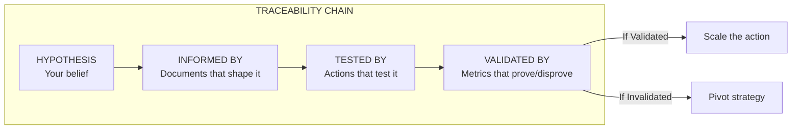
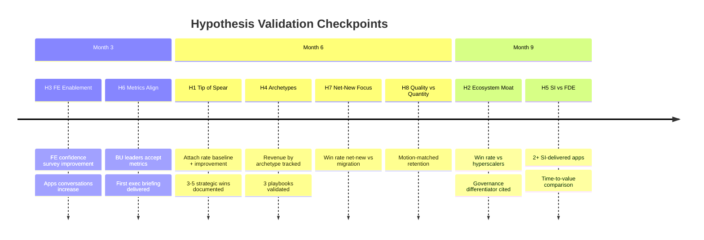

# Hypothesis Traceability Matrix

*This document maps each hypothesis to its validation path: what documents inform it, what actions test it, and what metrics prove or disprove it.*

**Related Documents:** [Hypotheses and Beliefs](01_hypotheses_and_beliefs.md) | [Action Plan](../40_execution/01_action_plan.md)

---

## Traceability Framework



---

## Validation Timeline



---

## Master Traceability Table

| ID | Hypothesis | Informed By | Tested By | Validated By | Decision Point |
|----|------------|-------------|-----------|--------------|----------------|
| H1 | Apps as Tip of the Spear | Sales Plays, ICP | Strategic wins, Attach tracking | Attach rate, Influenced ACV | Month 6 |
| H2 | Ecosystem Moat | Positioning, Sales Plays | Competitive wins, Messaging | Win rate vs hyperscalers | Month 9 |
| H3 | Full-Funnel GTM Gap | Field Enablement | Enablement sprint | FE confidence, Apps conversations | Month 3 |
| H4 | Three Archetypes | Sales Plays, ICP | Playbook pilots | Revenue by archetype | Month 6 |
| H5 | SI vs FDE | Partners | SI pilot | SI-delivered Apps, TTV | Month 9 |
| H6 | Metrics Align BUs | ICP, Incentives | BU alignment | BU investment in Apps GTM | Month 3 |
| H7 | Net-New Focus | Product Context, Positioning | Opportunity qualification | Win rate net-new vs migration | Month 6 |
| H8 | Quality vs Quantity | ICP, Partners | Motion pilots | Retention by motion | Month 6 |

---

## Detailed Traceability by Hypothesis

### H1: Apps as Tip of the Spear

| Phase | Action | Timeline | Owner | Output |
|-------|--------|----------|-------|--------|
| P1 | Document strategic wins with attach narrative | M1-M3 | Adoption Architect | 3-5 win stories |
| P2 | Implement attach rate tracking | M4 | Analytics + AA | Dashboard live |
| P2 | Establish attach rate baseline | M6 | Analytics | Baseline number |
| P3 | Measure attach rate improvement | M9-M12 | Analytics | Trend data |

| Metric | Source | Target | Current |
|--------|--------|--------|---------|
| Attach rate (% expand to other SKUs) | SFDC + telemetry | TBD | Not measured |
| Time-to-expansion (days) | Telemetry | TBD | Not measured |
| Influenced ACV | Finance | TBD | Not measured |

---

### H2: Ecosystem Synergy Is the Moat

| Phase | Action | Timeline | Owner | Output |
|-------|--------|----------|-------|--------|
| P1 | Capture competitive win stories | M1-M3 | Adoption Architect | Win narratives |
| P2 | Multi-product correlation analysis | M4-M6 | Analytics | Correlation data |
| P2 | Win/loss analysis with moat attribution | M4-M6 | Adoption Architect | Loss patterns |

| Metric | Source | Target | Current |
|--------|--------|--------|---------|
| Competitive win rate vs hyperscalers | SFDC | TBD | Not measured |
| Multi-product usage correlation | Telemetry | TBD | Not measured |
| Customer moat quotes | Interviews | 5+ quotes | 0 |

---

### H3: Full-Funnel GTM Gap

| Phase | Action | Timeline | Owner | Output |
|-------|--------|----------|-------|--------|
| P1 | FE confidence survey (baseline) | M1 W2 | Adoption Architect | Baseline score |
| P1 | Security patterns training | M2 | Enablement + AA | Training delivered |
| P1 | App discovery workshop | M2-M3 | Enablement + AA | Workshop piloted |
| P1 | FE confidence survey (post) | M3 W4 | Adoption Architect | Post score |

| Metric | Source | Target | Current |
|--------|--------|--------|---------|
| FE confidence score | Survey | +20% improvement | Not measured |
| Apps conversations per FE | Activity tracking | TBD | Not measured |
| Win rate: Enabled vs non-enabled | SFDC | Enabled > non-enabled | Not measured |

---

### H4: Three App Archetypes Drive 80%

| Phase | Action | Timeline | Owner | Output |
|-------|--------|----------|-------|--------|
| P1 | Classify top 20 customers by archetype | M1 W2 | Adoption Architect | Classification |
| P2 | Business Cockpit playbook | M5 | Adoption Architect | Playbook v1 |
| P2 | Deep Vertical playbook | M5 | Adoption Architect | Playbook v1 |
| P2 | Playbook pilot with 2 FE teams | M5 W3 | AA + FE | Pilot feedback |

| Metric | Source | Target | Current |
|--------|--------|--------|---------|
| % of wins by archetype | SFDC analysis | 80% in 3 archetypes | Not measured |
| Win rate by archetype | SFDC | TBD | Not measured |
| Playbook adoption rate | Field feedback | 70% usage | Not measured |

---

### H5: SI Partnerships Can Counter Palantir's FDE Motion

| Phase | Action | Timeline | Owner | Output |
|-------|--------|----------|-------|--------|
| P2 | SI partnership assessment | M6 | AA + Partners | Partner shortlist |
| P3 | SI enablement program design | M8 | AA + Partners | Enablement plan |
| P3 | SI pilot launch (1-2 partners) | M9 | Partners + AA | Pilot live |
| P3 | SI pilot retrospective | M11 | Partners + AA | Results analysis |

| Metric | Source | Target | Current |
|--------|--------|--------|---------|
| SI time-to-value vs internal | Project tracking | SI ≤ internal | Not measured |
| SI-sourced pipeline | SFDC | TBD | Not measured |
| SI customer satisfaction | CSAT | ≥ internal | Not measured |

---

### H6: Influenced Revenue Metrics Will Align BU Leaders

| Phase | Action | Timeline | Owner | Output |
|-------|--------|----------|-------|--------|
| P1 | BU leader interviews on metrics | M1-M2 | Adoption Architect | Feedback |
| P1 | Attach rate definition proposal | M2 W4 | Adoption Architect | Proposal doc |
| P2 | Finance alignment on methodology | M4-M5 | AA + Finance | Approved method |
| P2 | Attach rate dashboard | M4-M6 | Analytics + AA | Dashboard live |

| Metric | Source | Target | Current |
|--------|--------|--------|---------|
| BU leader acceptance | Stakeholder feedback | 3+ SVP/VPs | 0 |
| Finance approval | Finance team | Approved | Not submitted |
| Comp discussion | FE leadership | On agenda | Not started |

---

### H7: Net-New Apps (Not Migration) Is the Right Focus

| Phase | Action | Timeline | Owner | Output |
|-------|--------|----------|-------|--------|
| P1 | Tag opportunities as net-new vs migration | M1 | Sales Ops + AA | SFDC field |
| P2 | Win/loss analysis by opportunity type | M4-M6 | Adoption Architect | Analysis |
| P2 | Customer satisfaction by type | M5-M6 | CS + AA | CSAT data |

| Metric | Source | Target | Current |
|--------|--------|--------|---------|
| Win rate: Net-new vs migration | SFDC | Net-new > migration | Not measured |
| CSAT: Net-new vs migration | CSAT data | Net-new > migration | Not measured |
| Pipeline: % net-new | SFDC | >70% net-new | Not measured |

---

### H8: Quality vs Quantity Determines Success

| Phase | Action | Timeline | Owner | Output |
|-------|--------|----------|-------|--------|
| P1 | Align with PS on Apps capacity | M1 | AA + PS | Engagement model |
| P1 | Get baseline retention by segment | M1 | AA + Analytics | Baseline data |
| P2 | Pilot Quality motion with lighthouse | M2-M3 | AA + PS | Pilot results |
| P2 | Pilot Quantity motion with DN | M5 | AA + ISV | Pilot results |

| Metric | Source | Target | Current |
|--------|--------|--------|---------|
| Retention by segment | Product telemetry | Quality > Quantity for Enterprise | Not measured |
| PS engagement correlation | PS + Product | Positive correlation | Not measured |
| IDE usage correlation (DN) | Product + ISV | Positive correlation | Not measured |

---

## Hypothesis Decision Timeline

```
┌─────────────────────────────────────────────────────────────────┐
│                    DECISION TIMELINE                            │
├─────────────────────────────────────────────────────────────────┤
│                                                                 │
│   MONTH 1-2          MONTH 3           MONTH 6        MONTH 9   │
│   ─────────          ───────           ───────        ───────   │
│                                                                 │
│   Baseline data      H3 Decision:      H1, H6, H7     H5 Decision│
│   collection         Enablement        H8 Decisions:  SI Pilot   │
│                      working?          Metrics,       working?   │
│   H3: FE survey                        Attach,                   │
│   H4: Classification H6 Decision:      Net-new,       H2 Decision│
│   H6: BU interviews  BU buy-in?        Motions        Moat real? │
│                                                                 │
│                                        H4 Decision:              │
│                                        Archetypes                │
│                                        hold?                     │
│                                                                 │
└─────────────────────────────────────────────────────────────────┘
```

---

## Validation Status Dashboard

| Hypothesis | Data Status | Test Status | Decision Due | Decision |
|------------|-------------|-------------|--------------|----------|
| H1: Tip of Spear | ⬜ No baseline | ⬜ Not started | Month 6 | Pending |
| H2: Ecosystem Moat | ⬜ No baseline | ⬜ Not started | Month 9 | Pending |
| H3: Full-Funnel GTM | ⬜ No baseline | ⬜ Not started | Month 3 | Pending |
| H4: Three Archetypes | ⬜ No baseline | ⬜ Not started | Month 6 | Pending |
| H5: SI vs FDE | ⬜ No baseline | ⬜ Not started | Month 9 | Pending |
| H6: Metrics Align BUs | ⬜ No baseline | ⬜ Not started | Month 3 | Pending |
| H7: Net-New Focus | ⬜ No baseline | ⬜ Not started | Month 6 | Pending |
| H8: Quality vs Quantity | ⬜ No baseline | ⬜ Not started | Month 6 | Pending |

*Update this table as validation progresses.*

---

## If Hypothesis Is Invalidated

| Hypothesis | Pivot If Wrong |
|------------|----------------|
| H1: Tip of Spear | Reposition Apps as standalone value prop, not platform play |
| H2: Ecosystem Moat | Compete on specific features, not integration |
| H3: Full-Funnel GTM | Focus on product improvements, not training |
| H4: Three Archetypes | Develop more granular or different segmentation |
| H5: SI vs FDE | Consider internal FDE build for strategic accounts |
| H6: Metrics Align BUs | Find alternative alignment mechanism (exec mandate, etc.) |
| H7: Net-New Focus | Accelerate migration capability investment |
| H8: Quality vs Quantity | Investigate other retention drivers |

---

*Last Updated: January 2026*

