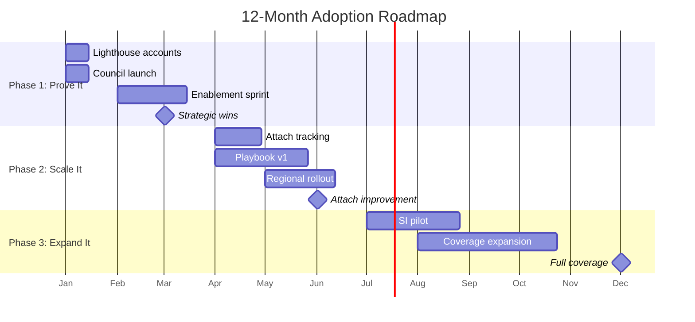

# 3-6-12 Month Action Plan

*Action-oriented plan with specific deliverables, owners, and timelines.*

**Related Documents:** [Hypotheses](../30_framework/01_hypotheses_and_beliefs.md) | [Traceability](../30_framework/02_traceability_matrix.md)

---

## Plan Overview

---

## Hypothesis-Action Connection

| Phase | Primary Hypotheses Tested | Decision Point |
|-------|---------------------------|----------------|
| **P1 (M1-3)** | H3 (Full-Funnel GTM), H6 (Metrics Align), H8 (Motions) | Month 3: Enablement working? BU buy-in? |
| **P2 (M4-6)** | H1 (Tip of Spear), H4 (Archetypes), H7 (Net-New), H8 | Month 6: Attach improving? Archetypes hold? |
| **P3 (M7-12)** | H2 (Moat), H5 (SI vs FDE) | Month 9: Moat real? SI working? |

---

## Phase 1: Prove It (Month 1-3)

### Objective
Land 3-5 strategic wins that prove Apps can drive deep platform adoption.

### Key Results

| KR | Target | Measurement |
|----|--------|-------------|
| KR1 | 3-5 strategic wins documented | Win narratives with business value |
| KR2 | FE enablement for top 3 topics complete | Training completion rate |
| KR3 | Apps Adoption Council launched | Weekly cadence established |
| KR4 | Exec alignment with 3+ BU leaders | Sponsorship commitments |
| KR5 | Quality motion piloted | 3 lighthouse accounts |

---

### Month 1: Foundation

| Week | Deliverable | Tests Hypothesis | Owner |
|------|-------------|------------------|-------|
| **W1** | Lighthouse account list (10-15 accounts) | H1, H4 | Adoption Architect |
| **W1** | Apps Adoption Council charter + invite | All | Adoption Architect |
| **W2** | Security/governance patterns v1 (draft) | H3 | Adoption Architect |
| **W2** | First Apps Adoption Council meeting | All | Adoption Architect |
| **W2** | FE confidence survey (baseline) | H3 | Adoption Architect |
| **W3** | Lighthouse account outreach (top 5) | H1, H4 | AA + FE |
| **W3** | Competitive talk track v1 (Palantir focus) | H5 | Adoption Architect |
| **W3-4** | Align with 3 industry leads on Apps use cases | H3 | Adoption Architect |
| **W4** | Exec briefing deck for SVP/VP alignment | H6 | Adoption Architect |
| **W4** | App discovery workshop design | H3, H4 | AA + Enablement |
| **W4** | Create guided selling triggers v1 | H3 | Adoption Architect |
| **W2-4** | Align with PS leadership on Apps capacity | H8 | AA + PS |
| **W3** | Get baseline retention data by segment | H8 | AA + Analytics |

**Month 1 Checkpoint:** Council running, lighthouse accounts identified, first enablement drafts ready, FE baseline captured, industry leads engaged, PS alignment started.

---

### Month 2: Enablement Sprint

| Week | Deliverable | Tests Hypothesis | Owner |
|------|-------------|------------------|-------|
| **W5** | Security/governance patterns finalized | H3 | Adoption Architect |
| **W5** | Exec alignment meetings (2-3 SVP/VPs) | H6 | Adoption Architect |
| **W6** | Security patterns training pilot (HLS + FSI) | H3 | AA + Enablement |
| **W6** | Lighthouse account deep-dives (3 accounts) | H1, H4, H7 | AA + FE |
| **W7** | App discovery workshop pilot | H3, H4 | AA + Enablement |
| **W7** | Competitive talk track training | H5 | Adoption Architect |
| **W8** | First strategic win candidate identified | H1 | AA + FE |
| **W8** | Attach rate definition proposal to BU leaders | H6 | Adoption Architect |
| **W6-8** | Document "Month of Apps" playbook | H3 | Adoption Architect |
| **W7** | Propose Apps demo for Data+AI Summit 2026 | H3 | Marketing + AA |
| **W8** | Guided selling triggers training pilot | H3 | Adoption Architect |
| **W5-6** | PS engagement for lighthouse accounts | H8 | AA + PS |
| **W7** | Correlate PS engagement with retention | H8 | AA + Analytics |

**Month 2 Checkpoint:** First enablement delivered, lighthouse accounts progressing, exec buy-in building, hackathon playbook documented, PS engaged for Quality motion.

---

### Month 3: First Wins

| Week | Deliverable | Tests Hypothesis | Owner |
|------|-------------|------------------|-------|
| **W9** | Strategic win #1 documented | H1, H4 | AA + FE |
| **W9** | Enablement scaled to all regulated verticals | H3 | Enablement team |
| **W10** | Loss analysis framework v1 | H2, H7 | Adoption Architect |
| **W10** | PM feedback synthesis (Q1) | All | Adoption Architect |
| **W11** | Strategic win #2-3 in progress | H1, H4 | AA + FE |
| **W11** | BU+1 newsletter #1 (Apps edition) | H6 | Adoption Architect |
| **W12** | FE confidence survey (post-enablement) | H3 | Adoption Architect |
| **W12** | Phase 1 retrospective + Phase 2 plan | All | Adoption Architect |
| **W12** | Exec readout on strategic wins | H6 | Adoption Architect |
| **W10-12** | Define EBC Apps coverage standard | H3 | AA + EBC Team |
| **W11** | Create App First Demo repository | H3 | AA + Industry Leads |
| **W9-10** | Pilot Quality motion with 3 lighthouse | H8 | AA + PS + FE |
| **W11** | Document Quality motion playbook draft | H8 | Adoption Architect |
| **W12** | Retention tracking by motion (baseline) | H8 | AA + Analytics |

**Month 3 Checkpoint:** 2-3 strategic wins, enablement scaled, exec alignment confirmed, EBC standard defined, demo repository live, Quality motion piloted.

### Phase 1 Hypothesis Decisions (End of Month 3)

| Hypothesis | Decision Criteria | If Validated | If Invalidated |
|------------|-------------------|--------------|----------------|
| **H3** | FE confidence improved ≥20% | Scale enablement to all verticals | Investigate product blockers |
| **H6** | 3+ BU leaders accept metrics | Operationalize attach tracking | Revise metric definitions |
| **H8** | PS-engaged accounts show higher retention | Scale Quality motion with PS | Investigate other retention drivers |

---

## Phase 2: Scale It (Month 4-6)

### Objective
Build attach rate tracking and scale proven playbooks across verticals.

### Key Results

| KR | Target | Measurement |
|----|--------|-------------|
| KR1 | Attach rate tracking live | Dashboard operational |
| KR2 | Playbook v1 published | Field adoption rate |
| KR3 | 5+ additional strategic wins | Win narratives |
| KR4 | PM roadmap influence demonstrated | Features prioritized |
| KR5 | Both motions piloted with playbooks | Retention improvement |

---

### Month 4-6 Deliverables

| Month | Key Deliverables | Owner |
|-------|------------------|-------|
| **M4** | Attach rate tracking, Reference architectures (backend), EBC pilot | AA + Analytics |
| **M5** | Business Cockpit playbook, Deep Vertical playbook, Playbook pilots | Adoption Architect |
| **M6** | Playbook v1 published, Attach rate baseline, Both motion playbooks | Adoption Architect |

### Phase 2 Hypothesis Decisions (End of Month 6)

| Hypothesis | Decision Criteria | If Validated | If Invalidated |
|------------|-------------------|--------------|----------------|
| **H1** | Attach rate measurable and positive | Emphasize "tip of spear" narrative | Reposition Apps as standalone |
| **H4** | 80%+ wins fit 3 archetypes | Scale archetype playbooks | Refine or expand archetypes |
| **H7** | Net-new win rate > migration | Maintain net-new focus | Reconsider migration for FY27 |
| **H8** | Motion-matched accounts better retention | Scale motion-specific playbooks | Investigate unified approach |

---

## Phase 3: Expand It (Month 7-12)

### Objective
Drive coverage expansion and establish sustainable operating rhythm.

### Key Results

| KR | Target | Measurement |
|----|--------|-------------|
| KR1 | Coverage: 50+ unique accounts with production Apps | Telemetry |
| KR2 | Attach rate improvement vs. baseline | Dashboard |
| KR3 | SI partnership pilot | 1-2 SIs engaged |
| KR4 | Playbook v2 with product updates | Field adoption |

---

### Month 7-12 Deliverables

| Month | Key Deliverables | Owner |
|-------|------------------|-------|
| **M7-8** | Coverage campaign launch, SI partner identification, Horizontal playbook | AA + Partners |
| **M9** | SI pilot launch, Coverage milestone (30 accounts), Quantity motion scale | AA + Partners |
| **M10-11** | Playbook v2 published, SI pilot retrospective, Coverage milestone (50) | Adoption Architect |
| **M12** | FY27 plan draft, Annual retrospective | Adoption Architect |

### Phase 3 Hypothesis Decisions (End of Month 9-12)

| Hypothesis | Decision Criteria | If Validated | If Invalidated |
|------------|-------------------|--------------|----------------|
| **H2** | Win rate vs hyperscalers improving | Double down on ecosystem messaging | Compete on specific features |
| **H5** | SI time-to-value ≤ internal | Scale SI program for FY27 | Consider internal FDE build |

---

## Success Criteria by Phase

| Phase | You've Succeeded If... | You've Failed If... |
|-------|------------------------|---------------------|
| **P1** | 3+ strategic wins, exec sponsorship, enablement delivered | No wins, no exec buy-in, enablement not adopted |
| **P2** | Attach tracking live, playbooks used, 5+ wins | No tracking, playbooks ignored, pipeline stalled |
| **P3** | 50+ accounts, attach improved, SI motion started | Coverage flat, attach declining, no SI traction |

---

## Operating Rhythms

| Rhythm | Frequency | Start | Owner |
|--------|-----------|-------|-------|
| Apps Adoption Council | Weekly | M1 W2 | Adoption Architect |
| BU+1 Newsletter | Monthly | M3 W3 | Adoption Architect |
| Exec Readout | Quarterly | M3 W4 | Adoption Architect |
| PM Feedback Synthesis | Quarterly | M3 W2 | Adoption Architect |
| Loss Analysis Review | Monthly | M3 W2 | Adoption Architect |

---

## Risk Mitigation

| Risk | Likelihood | Impact | Mitigation |
|------|------------|--------|------------|
| Lighthouse accounts don't convert | Medium | High | Diversify pipeline, lower qualification bar |
| Enablement doesn't change behavior | Medium | High | Exec mandate, measure completion + application |
| Product gaps block wins | High | Medium | Position for right use cases, manage expectations |
| BU leaders don't accept attach metrics | Medium | High | Start qualitative, build to quantitative |
| FE time constraints | High | Medium | Prioritize top accounts, leverage SI partners |

---

*Last Updated: January 2026*

