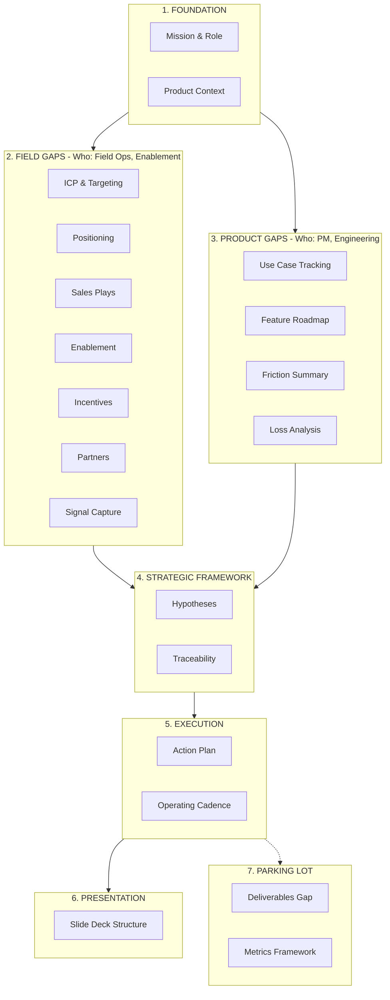

# Databricks Apps Adoption Playbook

---

## What is this?

A structured playbook for driving adoption of Databricks Apps, organized by **Field Gaps** vs **Product Gaps**.

---

## Audience

| Role | What You'll Find |
|------|------------------|
| **GTM Leaders** | Strategic wins, attach rate metrics, pipeline health, exec readouts |
| **GTM ICs (FE/SA)** | Sales plays, objection handling, guided selling triggers, enablement |
| **Product Managers** | Field signal, loss analysis, feature adoption, friction summary |
| **Adoption Architects** | Hypotheses, traceability, action plan, operating cadence, deliverables |

---

## How to Use This Playbook

### The Mission

> Help BU+1s hit product targets by turning customer adoption friction into prioritized cross-functional action and scalable GTM product plays.

### North Star Metrics

| Phase | Metric | Customer Focus |
|-------|--------|----------------|
| 3-6 months | Strategic Wins | Quality motion (Enterprise) |
| 6-9 months | Attach Rates | Both |
| 12+ months | Coverage | Quantity motion (Digital Native) |

### Key Hypotheses

| ID | Belief | Decision Point |
|----|--------|----------------|
| H1 | Apps as Tip of the Spear | Month 6 |
| H2 | Ecosystem Synergy Is the Moat | Month 9 |
| H3 | Full-Funnel GTM Gap | Month 3 |
| H4 | Three Archetypes Drive 80% | Month 6 |
| H5 | SI Partnerships Counter Palantir | Month 9 |
| H6 | Metrics Will Align BU Leaders | Month 3 |
| H7 | Net-New Focus Is Right | Month 6 |
| H8 | Quality vs Quantity Matters | Month 6 |

### Getting Started

1. **Start with [Mission](01_foundation/01_mission_and_role.md)** to understand our role
2. **Read [Hypotheses](30_framework/01_hypotheses_and_beliefs.md)** to see core beliefs
3. **Navigate by owner:**
   - **Field issues?** → [10_field/](10_field/)
   - **Product issues?** → [20_product/](20_product/)
4. **Execute from [Action Plan](40_execution/01_action_plan.md)** week by week
5. **Track validation in [Traceability](30_framework/02_traceability_matrix.md)** at decision points
6. **Present with [Presentation Structure](presentation_structure.md)** for exec and peer reviews
7. **Review [Parking Lot](parking_lot/)** for future work and integration items

---

## Wiki Structure

---

## Quick Navigation

### 1. Foundation

| Chapter | Description |
|---------|-------------|
| [Mission and Role](01_foundation/01_mission_and_role.md) | Role definition, operating model |
| [Product Context](01_foundation/02_product_context.md) | Product state, roadmap, sweet spot |

### 2. Field Gaps

| Chapter | Owner | Description |
|---------|-------|-------------|
| [ICP and Targeting](10_field/01_icp_and_targeting.md) | Field Ops | Customer segmentation, lighthouse selection |
| [Positioning and Messaging](10_field/02_positioning_and_messaging.md) | Marketing | Honest positioning, competitive messaging |
| [Sales Plays and Patterns](10_field/03_sales_plays_and_patterns.md) | Field Enablement | Archetypes, objection handling |
| [Field Enablement](10_field/04_field_enablement.md) | Enablement | Training priorities, events, EBCs |
| [Field Incentives](10_field/05_field_incentives.md) | Sales Ops | Recognition, SPIFs, signal capture |
| [Partner Ecosystem](10_field/06_partner_ecosystem.md) | Partners | FE, ISVs, SIs, Industry Leads, PS |
| [Signal Capture](10_field/07_signal_capture.md) | Sales Ops | Feedback loops, PM influence |

### 3. Product Gaps

| Chapter | Owner | Description |
|---------|-------|-------------|
| [Use Case Tracking](20_product/01_use_case_tracking.md) | PM | Archetype validation, pattern detection |
| [Feature Adoption Roadmap](20_product/02_feature_adoption_roadmap.md) | PM | DBUs, CSAT, adoption metrics |
| [Friction Summary](20_product/03_friction_summary.md) | PM | Product gaps, workarounds |
| [Loss Analysis](20_product/04_loss_analysis.md) | AA | Deal losses, competitive intel |

### 4. Strategic Framework

| Chapter | Description |
|---------|-------------|
| [Hypotheses and Beliefs](30_framework/01_hypotheses_and_beliefs.md) | 8 testable hypotheses with data needs |
| [Traceability Matrix](30_framework/02_traceability_matrix.md) | Hypothesis → Action → Validation chain |

### 5. Execution

| Chapter | Description |
|---------|-------------|
| [Action Plan](40_execution/01_action_plan.md) | 3-6-12 month roadmap with deliverables |
| [Operating Cadence](40_execution/02_operating_cadence.md) | Meetings, rhythms, communication |

### 6. Presentation

| Chapter | Description |
|---------|-------------|
| [Presentation Structure](presentation_structure.md) | 45-min panel deck with speaker notes and Q&A backup |

### 7. Parking Lot

*Future work and integration items awaiting prioritization.*

| Item | Description |
|------|-------------|
| [Deliverables Gap Analysis](parking_lot/deliverables.md) | Missing deliverables mapped to field/product gaps and phases |
| [Metrics Framework](parking_lot/metrics.md) | Consolidated metrics, data sources, and dashboard specs |

---

*Last Updated: January 2026*

