# Databricks Apps Adoption Playbook - Panel Presentation

**Duration:** 35 minutes content + 25 minutes Q&A  
**Slides:** 13 content slides + 5 partition slides  
**Audience:** Adoption Strategy Leadership Panel

---

# ═══════════════════════════════════════════════════════════════
# PARTITION: INTRODUCTION
# ═══════════════════════════════════════════════════════════════

---

## Slide 1: About Me

**Time:** 2-3 minutes

### Career Journey

| Period | Role | Highlights |
|--------|------|------------|
| **Pre-Databricks** | Big Data roles | Ameriprise, FINRA, Optum, Walgreens, Atos |
| **2019-2021** | Solutions Architect, NY | Joined Databricks, hands-on technical selling |
| **2021-2022** | FE Leader, NY Core | First leadership role, team building |
| **2022-2024** | FE Leader, Retail NE | Regional ownership, industry depth |
| **2024-Present** | RCT Hunting Lead | National team: 3 sub-BUs, 16 SAs, 1 FLM |

### Why I'm a Good Fit

| Strength | Proof Point |
|----------|-------------|
| **Recovering Data Scientist** | [Milestone Analysis across RCT Products](https://docs.google.com/spreadsheets/d/19ihrfgv2TirYY04h3YDDGGR1dONhuWHKNvkcTdlCkmA/edit?gid=248111445#gid=248111445) |
| **Process Builder** | [Practice Lead Org Design](https://docs.google.com/document/d/1QVYFzaMA5OaNbPAVSzV_xGKXIpD8PR2qZwzEjYm24jU/edit?tab=t.0#heading=h.rltclwhjjjno) - Processes outlast people |
| **Apps Champion** | [Month of Apps Launch](https://month-of-apps-kickoff.netlify.app/) + [Peet's Coffee Win](https://drive.google.com/file/d/1EclOdU6vePXFhT_kGumd6E50vlvItGSQ/view?usp=sharing) |
| **Product Collaborator** | [NPD DBSQL Deep Dive](https://docs.google.com/document/d/1EMPdoZXW40oclR-kq3dEX-d_cjP4q-RACV8fYPOt_S8/edit?tab=t.0) with Shant |

---

**Related Docs:**
1. [README - About Me](README.md) → Full career details and proof points
2. [Mission and Role](01_foundation/01_mission_and_role.md) → AA operating model
3. [Month of Apps Site](https://month-of-apps-kickoff.netlify.app/) → RCT program evidence

---

# ═══════════════════════════════════════════════════════════════
# PARTITION: THE OPPORTUNITY
# ═══════════════════════════════════════════════════════════════

---

## Slide 2: Problem + Why Now

**Time:** 3 minutes

### The Problem

```
┌─────────────────────────────────────────────────────────────────┐
│                    CURRENT STATE: ORGANIC CHAOS                  │
├─────────────────────────────────────────────────────────────────┤
│                                                                 │
│   REVENUE:  $5M ──────────────────────────► $70M  (14x growth)  │
│                                                                 │
│   BUT:      ❌ No clear ICP definition                          │
│             ❌ FE not enabled (cookbook "doesn't show good")    │
│             ❌ Product gaps killing deals (security, scaling)   │
│             ❌ No attach rate tracking                          │
│             ❌ Signal to PM is ad-hoc                           │
│                                                                 │
│   RISK:     Organic growth will plateau without deliberate GTM  │
│                                                                 │
└─────────────────────────────────────────────────────────────────┘
```

### Why Now Is the Right Moment

| Signal | Evidence |
|--------|----------|
| **Market Validated** | 14x organic growth = demand exists |
| **Platform Synergies Maturing** | Lakebase + Unity Catalog + Model Serving = moat |
| **Competitive Window** | Hyperscalers lack data platform integration; ISVs lack compute |
| **Executive Priority** | Apps positioned as strategic attach driver |

### Positioning Matrix: Where We Win vs. Wait

```
┌─────────────────────────────────────────────────────────────────┐
│                    POSITIONING MATRIX                           │
├─────────────────────────────────────────────────────────────────┤
│                                                                 │
│                    INTERNAL              EXTERNAL               │
│                    ────────              ────────               │
│   LOW TRAFFIC      ✅ SWEET SPOT         ⚠️ AUTH WORKAROUND     │
│                    Lead aggressively     Customer's auth layer  │
│                                                                 │
│   HIGH TRAFFIC     ⚠️ CAUTION            ❌ NOT READY           │
│                    Vertical limits       Wait for product       │
│                                                                 │
│   AI-POWERED       ✅ DIFFERENTIATED     ⚠️ INTERNAL ONLY       │
│                    Lead with moat        Model Serving + Apps   │
│                                                                 │
│   REGULATED        ✅ IF INTERNAL        ❌ COMPLIANCE GAPS     │
│   (FSI/HLS)        Unity Catalog shines  No ingress/egress      │
│                                                                 │
└─────────────────────────────────────────────────────────────────┘
```

---

**Related Docs:**
1. [Product Context](01_foundation/02_product_context.md) → Revenue data, product state, roadmap
2. [Positioning](10_field/02_positioning_and_messaging.md) → Full positioning framework, moat pillars
3. [Friction Summary](20_product/03_friction_summary.md) → Product gap clusters, workarounds

---

# ═══════════════════════════════════════════════════════════════
# PARTITION: MY APPROACH
# ═══════════════════════════════════════════════════════════════

---

## Slide 3: What Good Looks Like - My Approach

**Time:** 3 minutes

### Four Principles

```
┌─────────────────────────────────┬─────────────────────────────────┐
│                                 │                                 │
│   1. HYPOTHESIS-DRIVEN          │   2. MOTION-MATCHED             │
│   ─────────────────────         │   ───────────────               │
│                                 │                                 │
│   • Test beliefs explicitly     │   • Quality motion (Enterprise) │
│   • Pivot when invalidated      │   • Quantity motion (Dig Native)│
│   • NOT "hope it works"         │   • Match approach to customer  │
│   • Decision points at M3/M6/M9 │   • PS for Quality, Self-serve  │
│                                 │     for Quantity                │
│                                 │                                 │
├─────────────────────────────────┼─────────────────────────────────┤
│                                 │                                 │
│   3. HONEST POSITIONING         │   4. MEASURED + INSTRUMENTED    │
│   ─────────────────────         │   ────────────────────────────  │
│                                 │                                 │
│   • Know when NOT to sell       │   • Attach rate (% expand)      │
│   • Lead where we're strong     │   • Influenced ACV              │
│   • Defer where not ready       │   • Retention by motion         │
│   • Build trust, not hype       │   • Signal to PM (not ad-hoc)   │
│                                 │                                 │
└─────────────────────────────────┴─────────────────────────────────┘
```

### What This Changes

| From (Organic) | To (Deliberate) |
|----------------|-----------------|
| "Hope it works" | Test → Learn → Pivot |
| One-size-fits-all | Motion-matched playbooks |
| Sell everywhere | Honest win/wait matrix |
| "Apps deployed" | Attach, ACV, Retention |

---

**Related Docs:**
1. [Hypotheses](30_framework/01_hypotheses_and_beliefs.md) → 8 testable beliefs with validation criteria
2. [ICP and Targeting](10_field/01_icp_and_targeting.md) → Motion definitions, customer segments
3. [Metrics Framework](parking_lot/metrics.md) → Full metrics inventory, data sources

---

## Slide 4: Framework - Hypothesis + Metrics + Traceability

**Time:** 4 minutes

### Traceability Chain


### 8 Hypotheses Summary

| ID | Belief | Decision Point | If Validated | If Invalidated |
|----|--------|----------------|--------------|----------------|
| **H1** | Apps as Tip of the Spear | Month 6 | Emphasize attach narrative | Reposition as standalone |
| **H2** | Ecosystem Synergy Is the Moat | Month 9 | Double down on ecosystem | Compete on features |
| **H3** | Full-Funnel GTM Gap | Month 3 | Scale enablement | Investigate product blockers |
| **H4** | Three Archetypes Drive 80% | Month 6 | Scale archetype playbooks | Refine archetypes |
| **H5** | SI Partnerships Counter Palantir | Month 9 | Scale SI program | Build internal FDE |
| **H6** | Metrics Will Align BU Leaders | Month 3 | Operationalize tracking | Revise metrics |
| **H7** | Net-New Focus Is Right | Month 6 | Maintain focus | Reconsider migration |
| **H8** | Quality vs Quantity Matters | Month 6 | Scale motion playbooks | Unified approach |

### Metrics Pyramid

```
┌─────────────────────────────────────────────────────────────────┐
│                    METRICS PYRAMID                              │
├─────────────────────────────────────────────────────────────────┤
│                                                                 │
│                      12+ MONTHS                                 │
│                    ┌───────────┐                                │
│                    │ COVERAGE  │  ← 50+ accounts                │
│                    └─────┬─────┘                                │
│                          │                                      │
│                    6-9 MONTHS                                   │
│               ┌──────────────────┐                              │
│               │   ATTACH RATES   │  ← % expand to other SKUs    │
│               └────────┬─────────┘                              │
│                        │                                        │
│                   3-6 MONTHS                                    │
│          ┌─────────────────────────┐                            │
│          │    STRATEGIC WINS       │  ← 3-5 decisive wins       │
│          └─────────────────────────┘                            │
│                                                                 │
│  Earlier phases MUST succeed for later phases to be meaningful  │
│                                                                 │
└─────────────────────────────────────────────────────────────────┘
```

---

**Related Docs:**
1. [Traceability Matrix](30_framework/02_traceability_matrix.md) → Full chain for each hypothesis
2. [Hypotheses](30_framework/01_hypotheses_and_beliefs.md) → Detailed beliefs, data needs, risks
3. [Metrics Framework](parking_lot/metrics.md) → Data sources, dashboard specs, instrumentation

---

# ═══════════════════════════════════════════════════════════════
# PARTITION: THE PLAYS
# ═══════════════════════════════════════════════════════════════

---

## Slide 5: Sales Play - Target + Trigger

**Time:** 3 minutes

### Target Criteria (ICP)

| Dimension | Strong Fit | Weak Fit |
|-----------|-----------|----------|
| **Data Footprint** | Large Lakehouse investment | No Databricks presence |
| **Use Case** | Net-new apps | Legacy migration |
| **User Type** | Business users needing data | Technical-only users |
| **Governance** | Strict requirements | Loose/none |
| **AI/ML** | Models in production | No ML footprint |

### Three Archetypes

```mermaid
flowchart LR
    subgraph Archetypes["APP ARCHETYPES"]
        BC["🎯 BUSINESS COCKPIT<br/>Full analytics stack<br/>for executives"]
        DV["🔬 DEEPLY VERTICAL<br/>Industry-specific<br/>AI-powered"]
        HZ["🛠️ HORIZONTAL<br/>Platform productivity<br/>tools"]
    end
    
    BC --> BusBuyer["Business Exec Buyer"]
    DV --> DomainBuyer["Domain Specialist Buyer"]
    HZ --> PlatformBuyer["Platform Team Buyer"]
```



### Guided Selling Triggers

| Customer Says/Does | Apps Opportunity? | Archetype | Next Step |
|--------------------|-------------------|-----------|-----------|
| "We need a dashboard for executives" | ✅ Yes | Cockpit | Qualify: What decisions? What data? |
| "Our BI tool isn't working for business users" | ✅ Yes | Cockpit/Horizontal | Demo: Self-serve analytics app |
| "We have ML models but can't operationalize them" | ✅ Yes | Vertical | Explore: Model serving in app layer |
| "Data team is bottleneck for business requests" | ✅ Yes | Horizontal | Demo: Self-serve data quality app |
| "We want to build a customer-facing portal" | ⚠️ Maybe | - | Check: Internal or external? |
| "We need infinite scalability" | ❌ No | - | Defer: Vertical scaling only today |

---

**Related Docs:**
1. [Sales Plays](10_field/03_sales_plays_and_patterns.md) → Full archetype details, more triggers
2. [ICP and Targeting](10_field/01_icp_and_targeting.md) → Complete ICP framework
3. [Deliverables](parking_lot/deliverables.md) → Trigger cards, qualification cheat sheet (to create)

---

## Slide 6: Sales Play - Position + Qualify + Close

**Time:** 3 minutes

### Positioning: The Databricks Apps Moat


### Objection Handling (4 Categories)

| Category | Objection | Response |
|----------|-----------|----------|
| **Money** | "Apps revenue is too small" | Focus on **influenced revenue** not direct |
| **Mindshare** | "Too many products to pitch" | Apps is a **container**—one pitch, multiple SKUs |
| **Maturity** | "Customer isn't ready" | Identify **maturity indicators** first |
| **Product** | "No horizontal scaling" | Position for **right use cases** (internal, moderate) |

### Qualification Questions

1. **Net-new or migration?** → Net-new = good fit
2. **Data gravity?** → Already in Lakehouse = strong fit
3. **AI-powered?** → Yes = differentiator
4. **End user?** → Business users = expands market
5. **Governance?** → Strict = strong fit (our moat)

### Success Criteria (Definition of Done)

| Element | Required |
|---------|----------|
| Target account identified | ✅ Named account with fit criteria |
| Trigger activated | ✅ Customer signal matched |
| Positioning delivered | ✅ Moat narrative landed |
| Objections handled | ✅ Responses documented |
| Qualified or disqualified | ✅ Go/No-go decision made |
| Win narrative captured | ✅ Business value documented |

---

**Related Docs:**
1. [Positioning](10_field/02_positioning_and_messaging.md) → Full moat framework, competitive talk tracks
2. [Sales Plays](10_field/03_sales_plays_and_patterns.md) → Complete objection handling
3. [Objections](parking_lot/objections.md) → Interview-tested responses (32 questions)

---

## Slide 7: Signals + Levers

**Time:** 3 minutes

### Signal Types


### Signal Capture Process


### Known Product Gaps (Top 5 Deal Blockers)

| Category | Gap | Use Case Blocked | Status |
|----------|-----|------------------|--------|
| **Security** | No public URLs without login | External-facing apps | ⬜ PM Aware |
| **Security** | No firewall / ingress-egress | FSI/HLS compliance | ⬜ PM Aware |
| **Scaling** | Vertical only | High-traffic apps | ⬜ PM Aware |
| **Cost** | Fixed 24x7 pricing | Cost-sensitive deals | ⬜ PM Aware |
| **Customization** | No custom domains | Branded apps | ⬜ PM Aware |

### How PM Gets Meaningful Signal

| Mechanism | Frequency | Content |
|-----------|-----------|---------|
| Apps Adoption Council | Weekly | Top blockers, customer names, ACV at risk |
| PM Feedback Synthesis | Quarterly | Prioritized gaps, loss analysis, competitive intel |
| Loss Analysis Review | Monthly | Deals lost, root cause, recovery candidates |

---

**Related Docs:**
1. [Signal Capture](10_field/07_signal_capture.md) → Full signal framework, field signal log template
2. [Loss Analysis](20_product/04_loss_analysis.md) → Deal loss tracking, recovery pipeline
3. [Friction Summary](20_product/03_friction_summary.md) → Product gap clusters, workarounds

---

# ═══════════════════════════════════════════════════════════════
# PARTITION: EXECUTION
# ═══════════════════════════════════════════════════════════════

---

## Slide 8: 3-6-12 Action Plan Overview

**Time:** 3 minutes

### 12-Month Roadmap


### Hypothesis-Action Connection

| Phase | Primary Hypotheses | Decision Point | Key Question |
|-------|-------------------|----------------|--------------|
| **P1 (M1-3)** | H3, H6, H8 | Month 3 | Enablement working? BU buy-in? |
| **P2 (M4-6)** | H1, H4, H7, H8 | Month 6 | Attach improving? Archetypes hold? |
| **P3 (M7-12)** | H2, H5 | Month 9 | Moat real? SI working? |

### If Validated / If Invalidated

| Hypothesis | If Validated | If Invalidated |
|------------|--------------|----------------|
| H3 (FE Enablement) | Scale to all verticals | Investigate product blockers |
| H6 (Metrics Align) | Operationalize tracking | Revise metric definitions |
| H1 (Tip of Spear) | Emphasize attach narrative | Reposition as standalone |
| H8 (Motions) | Scale motion playbooks | Investigate unified approach |

---

**Related Docs:**
1. [Action Plan](40_execution/01_action_plan.md) → Full 12-month plan with weekly deliverables
2. [Traceability](30_framework/02_traceability_matrix.md) → Validation timeline, decision criteria
3. [Deliverables](parking_lot/deliverables.md) → Gap analysis, missing operational artifacts

---

## Slide 9: Phase 1 - Prove It (Month 1-3)

**Time:** 3 minutes

### Objective
> Land 3-5 strategic wins that prove Apps can drive deep platform adoption.

### Key Results

| KR | Target | Measurement |
|----|--------|-------------|
| KR1 | 3-5 strategic wins | Win narratives with business value |
| KR2 | FE enablement complete | Training completion rate (80%+) |
| KR3 | Council launched | Weekly cadence established |
| KR4 | 3+ BU leader alignment | Sponsorship commitments |
| KR5 | Quality motion piloted | 3 lighthouse accounts with PS |

### Month-by-Month Highlights

| Month | Key Deliverables | Owner |
|-------|------------------|-------|
| **M1** | Lighthouse list (10-15), Council charter, FE survey baseline, Industry lead alignment | AA + FE + PS |
| **M2** | Security patterns training, App discovery workshop, Competitive talk tracks, PS engagement | AA + Enablement |
| **M3** | Strategic wins documented, FE survey post, Exec readout, Quality motion playbook | AA + FE |

### Phase 1 Hypothesis Decisions (Month 3)

| Hypothesis | Decision Criteria | Owner |
|------------|-------------------|-------|
| **H3** | FE confidence improved ≥20% | AA + Enablement |
| **H6** | 3+ BU leaders accept metrics | AA + Finance |
| **H8** | PS-engaged accounts show higher retention | AA + Analytics |

---

**Related Docs:**
1. [Action Plan - Phase 1](40_execution/01_action_plan.md) → Week-by-week deliverables
2. [Field Enablement](10_field/04_field_enablement.md) → Training priorities, content needs
3. [Partner Ecosystem](10_field/06_partner_ecosystem.md) → PS alignment, capacity planning

---

## Slide 10: Phase 2 - Scale It (Month 4-6)

**Time:** 2 minutes

### Objective
> Build attach rate tracking and scale proven playbooks across verticals.

### Key Results

| KR | Target | Measurement |
|----|--------|-------------|
| KR1 | Attach tracking live | Dashboard operational |
| KR2 | Playbook v1 published | Field adoption rate |
| KR3 | 5+ additional wins | Win narratives |
| KR4 | PM influence demonstrated | Features prioritized |
| KR5 | Both motions piloted | Retention improvement |

### Deliverables

| Month | Key Deliverables |
|-------|------------------|
| **M4** | Attach rate tracking, Reference architectures, EBC pilot |
| **M5** | Business Cockpit playbook, Deep Vertical playbook, Regional rollout |
| **M6** | Playbook v1 published, Attach rate baseline, Motion playbooks |

### Phase 2 Hypothesis Decisions (Month 6)

| Hypothesis | Decision Criteria |
|------------|-------------------|
| **H1** | Attach rate measurable and positive |
| **H4** | 80%+ wins fit 3 archetypes |
| **H7** | Net-new win rate > migration |
| **H8** | Motion-matched accounts better retention |

---

**Related Docs:**
1. [Action Plan - Phase 2](40_execution/01_action_plan.md) → Full M4-6 deliverables
2. [Metrics Framework](parking_lot/metrics.md) → Attach rate definition, dashboard specs
3. [Sales Plays](10_field/03_sales_plays_and_patterns.md) → Playbook content, archetypes

---

## Slide 11: Phase 3 - Expand It (Month 7-12)

**Time:** 2 minutes

### Objective
> Drive coverage expansion and establish sustainable operating rhythm.

### Key Results

| KR | Target | Measurement |
|----|--------|-------------|
| KR1 | 50+ unique accounts | Product telemetry |
| KR2 | Attach rate improvement | Dashboard trend |
| KR3 | SI pilot complete | 1-2 SIs engaged |
| KR4 | Playbook v2 published | Field adoption |

### Deliverables

| Month | Key Deliverables |
|-------|------------------|
| **M7-8** | Coverage campaign, SI partner identification, Horizontal playbook |
| **M9** | SI pilot launch, Coverage milestone (30 accounts), Quantity motion scale |
| **M10-11** | Playbook v2, SI pilot retrospective, Coverage milestone (50) |
| **M12** | FY27 plan draft, Annual retrospective |

### Phase 3 Hypothesis Decisions (Month 9)

| Hypothesis | Decision Criteria |
|------------|-------------------|
| **H2** | Win rate vs hyperscalers improving |
| **H5** | SI time-to-value ≤ internal |

---

**Related Docs:**
1. [Action Plan - Phase 3](40_execution/01_action_plan.md) → Full M7-12 deliverables
2. [Partner Ecosystem](10_field/06_partner_ecosystem.md) → SI strategy, partner types
3. [Product Context](01_foundation/02_product_context.md) → Long-term vision, FY27 roadmap

---

## Slide 12: Operating Cadence + Governance

**Time:** 2 minutes

### Communication Cadence

| Rhythm | Frequency | Audience | Content |
|--------|-----------|----------|---------|
| **Apps Adoption Council** | Weekly | PM, FE reps, Enablement | Blockers, wins, PM feedback |
| **BU+1 Newsletter** | Monthly | SVPs, VPs | Strategic wins, metrics, ask |
| **Exec Readout** | Quarterly | SVP/VP FE | Hypothesis status, gaps, pivots |
| **PM Feedback Synthesis** | Quarterly | Product Management | Top blockers, loss analysis |

### Operating Rhythm

| Day | Morning | Afternoon |
|-----|---------|-----------|
| Monday | Week planning | Lighthouse account work |
| Tuesday | Apps Adoption Council | Enablement development |
| Wednesday | Account deep-dives | PM sync |
| Thursday | Field enablement | Industry lead alignment |
| Friday | Admin, content creation | Weekly summary |

### Risk Mitigation

| Risk | Likelihood | Impact | Mitigation |
|------|------------|--------|------------|
| Lighthouse accounts don't convert | Medium | High | Diversify pipeline, lower bar |
| Enablement doesn't change behavior | Medium | High | Exec mandate, measure application |
| Product gaps block wins | High | Medium | Position for right use cases |
| BU leaders don't accept metrics | Medium | High | Start qualitative, build to quantitative |
| FE time constraints | High | Medium | Prioritize top accounts, leverage SI |

---

**Related Docs:**
1. [Operating Cadence](40_execution/02_operating_cadence.md) → Full cadence detail, templates
2. [Mission and Role](01_foundation/01_mission_and_role.md) → AA operating model, responsibilities
3. [Metrics Framework](parking_lot/metrics.md) → Dashboard specs for each audience

---

# ═══════════════════════════════════════════════════════════════
# PARTITION: CLOSE
# ═══════════════════════════════════════════════════════════════

---

## Slide 13: The Ask + Q&A Backup

**Time:** 2 minutes + Q&A

### The Ask

| Need | Why It Matters |
|------|----------------|
| **Executive sponsorship** | BU alignment requires top-down support |
| **PM partnership** | Signal capture only works with responsive PM |
| **Analytics support** | Attach rate, retention metrics need instrumentation |
| **Enablement capacity** | Training content requires Enablement team |
| **PS engagement** | Quality motion needs delivery capacity |

### Success Criteria Summary

| Phase | You've Succeeded If... | You've Failed If... |
|-------|------------------------|---------------------|
| **P1** | 3+ strategic wins, exec sponsorship, enablement delivered | No wins, no exec buy-in, enablement not adopted |
| **P2** | Attach tracking live, playbooks used, 5+ wins | No tracking, playbooks ignored, pipeline stalled |
| **P3** | 50+ accounts, attach improved, SI motion started | Coverage flat, attach declining, no SI traction |

### Risk Register (Top 5)

| Risk | Mitigation | Owner |
|------|------------|-------|
| Lighthouse don't convert | Diversify, lower bar | AA |
| Enablement not adopted | Exec mandate | AA + Enablement |
| Product gaps block wins | Right positioning | AA + PM |
| BU leaders don't align | Start qualitative | AA + Finance |
| FE time constraints | SI leverage | AA + Partners |

### Q&A Backup

32 anticipated questions with sample answers available in:
→ [Objections - Interview Prep](parking_lot/objections.md)

Topics covered:
- Section 1-4: Process & Data questions
- Section 5: Product & Strategy questions

---

**Related Docs:**
1. [Objections](parking_lot/objections.md) → Full interview prep (32 questions + answers)
2. [Deliverables](parking_lot/deliverables.md) → Gap analysis, missing artifacts
3. [README](README.md) → Playbook home, navigation

---

# Appendix: Slide Timing Summary

| Slide | Topic | Time |
|-------|-------|------|
| 1 | About Me | 2-3 min |
| 2 | Problem + Why Now | 3 min |
| 3 | My Approach | 3 min |
| 4 | Framework | 4 min |
| 5 | Sales Play: Target + Trigger | 3 min |
| 6 | Sales Play: Position + Qualify + Close | 3 min |
| 7 | Signals + Levers | 3 min |
| 8 | 3-6-12 Overview | 3 min |
| 9 | Phase 1: Prove It | 3 min |
| 10 | Phase 2: Scale It | 2 min |
| 11 | Phase 3: Expand It | 2 min |
| 12 | Operating Cadence | 2 min |
| 13 | The Ask + Q&A | 2 min |
| **TOTAL** | | **35 min** |

---

*Last Updated: January 2026*

