# Databricks Apps Adoption Playbook - Panel Presentation

**Duration:** 35 min content + 25 min Q&A | **Slides:** 13 + partitions | **Audience:** Adoption Strategy Leadership

---

# ═══════════════════════════════════════════════════════════════
# PARTITION: INTRODUCTION
# ═══════════════════════════════════════════════════════════════

---

## Slide 1: About Me

> **So What:** Proven track record of building processes that scale, with deep Apps conviction.

| Period | Role |
|--------|------|
| Pre-Databricks | Big Data: Ameriprise, FINRA, Optum, Walgreens, Atos |
| 2019-2021 | Solutions Architect, NY |
| 2021-2024 | FE Leader: NY Core → Retail NE |
| 2024-Present | RCT Hunting Lead: 3 sub-BUs, 16 SAs, 1 FLM |

**Why I'm a Good Fit:**
- **Data-driven:** Built hypothesis validation into my leadership practice
- **Process builder:** Created Practice Lead motion that outlasts people
- **Apps champion:** Launched Month of Apps, closed Peet's Coffee with Apps-led GTM
- **Product partner:** Deep-dived DBSQL issues with PM (Shant)

→ [Full About Me](README.md) | [Month of Apps](https://month-of-apps-kickoff.netlify.app/) | [Practice Lead Design](https://docs.google.com/document/d/1QVYFzaMA5OaNbPAVSzV_xGKXIpD8PR2qZwzEjYm24jU)

---

# ═══════════════════════════════════════════════════════════════
# PARTITION: THE OPPORTUNITY
# ═══════════════════════════════════════════════════════════════

---

## Slide 2: Problem + Why Now

> **So What:** 14x organic growth proves demand, but we're leaving wins on the table.

```
┌─────────────────────────────────────────────────────────────────┐
│                    CURRENT STATE: ORGANIC CHAOS                 │
├─────────────────────────────────────────────────────────────────┤
│   REVENUE:  $5M ──────────────────────────► $70M  (14x growth)  │
│                                                                 │
│   BUT:      ❌ No ICP definition   ❌ FE not enabled            │
│             ❌ No attach tracking  ❌ Signal to PM is ad-hoc    │
│                                                                 │
│   RISK:     Organic growth will plateau without deliberate GTM │
└─────────────────────────────────────────────────────────────────┘
```

**Why Now:**
- Market validated (14x growth = demand exists)
- Platform synergies maturing (Lakebase + Unity Catalog + Model Serving)
- Competitive window open (hyperscalers lack integration, ISVs lack compute)

→ [Product Context](01_foundation/02_product_context.md) | [Positioning Matrix](10_field/02_positioning_and_messaging.md) | [Friction Summary](20_product/03_friction_summary.md)

---

# ═══════════════════════════════════════════════════════════════
# PARTITION: MY APPROACH
# ═══════════════════════════════════════════════════════════════

---

## Slide 3: What Good Looks Like

> **So What:** Shift from "hope it works" to deliberate, measurable, honest GTM.

**Four Principles:**

1. **Hypothesis-driven** — Test beliefs explicitly, pivot when invalidated
2. **Motion-matched** — Quality (Enterprise + PS) vs. Quantity (Digital Native + self-serve)
3. **Honest positioning** — Know when NOT to sell; build trust, not hype
4. **Measured + instrumented** — Attach rate, influenced ACV, retention—signal to PM

| From (Organic) | To (Deliberate) |
|----------------|-----------------|
| "Hope it works" | Test → Learn → Pivot |
| Sell everywhere | Honest win/wait matrix |
| "Apps deployed" | Attach, ACV, Retention |

→ [Hypotheses](30_framework/01_hypotheses_and_beliefs.md) | [ICP & Targeting](10_field/01_icp_and_targeting.md) | [Metrics Framework](parking_lot/metrics.md)

---

## Slide 4: 3 Core Bets

> **So What:** 3 testable bets with clear decision points—not 8 hypotheses to track.

```
┌─────────────────────────────────────────────────────────────────┐
│                         3 CORE BETS                             │
├─────────────────────────────────────────────────────────────────┤
│   WHY APPS?              WHERE TO PLAY?        HOW TO WIN?      │
│   ───────────            ──────────────        ───────────      │
│   Apps drive platform    Archetype-matched,    Full-funnel      │
│   expansion via          net-new, motion-      enablement +     │
│   ecosystem moat         aware targeting       SI + metrics     │
│                                                                 │
│   Tests:                 Tests:                Tests:           │
│   • Attach rate          • 80% fit archetypes  • FE confidence  │
│   • Competitive wins     • Motion-retention    • SI time-value  │
│                                                                 │
│   Decision: M6           Decision: M6          Decision: M3, M9 │
└─────────────────────────────────────────────────────────────────┘
```

→ [Traceability Matrix](30_framework/02_traceability_matrix.md) | [Hypotheses Detail](30_framework/01_hypotheses_and_beliefs.md) | [Metrics Pyramid](parking_lot/metrics.md)

---

# ═══════════════════════════════════════════════════════════════
# PARTITION: THE PLAYS
# ═══════════════════════════════════════════════════════════════

---

## Slide 5: Sales Play - Target + Trigger

> **So What:** FE needs simple triggers to spot Apps opportunities—3 archetypes cover 80%.

```mermaid
flowchart LR
    subgraph Archetypes["APP ARCHETYPES"]
        BC["🎯 BUSINESS COCKPIT<br/>Analytics for execs"]
        DV["🔬 DEEPLY VERTICAL<br/>Industry AI apps"]
        HZ["🛠️ HORIZONTAL<br/>Platform tools"]
    end
    
    BC --> BusBuyer["Business Exec"]
    DV --> DomainBuyer["Domain Specialist"]
    HZ --> PlatformBuyer["Platform Team"]
```



**Trigger Signals:**
- "We need a dashboard for executives" → **Cockpit**
- "We have ML models but can't operationalize them" → **Vertical**
- "Data team is bottleneck for business requests" → **Horizontal**
- "We need infinite scalability" → **Defer** (not ready)

→ [Sales Plays](10_field/03_sales_plays_and_patterns.md) | [ICP Framework](10_field/01_icp_and_targeting.md) | [Trigger Cards](parking_lot/deliverables.md)

---

## Slide 6: Sales Play - Position + Qualify

> **So What:** Lead with moat (UC + Lakebase + AI), qualify with 5 questions.


**5 Qualification Questions:**
1. Net-new or migration? → Net-new = fit
2. Data in Lakehouse? → Yes = strong fit
3. AI-powered? → Yes = differentiator
4. Business users? → Yes = expands market
5. Strict governance? → Yes = our moat

→ [Positioning](10_field/02_positioning_and_messaging.md) | [Objection Handling](10_field/03_sales_plays_and_patterns.md) | [Interview Prep](parking_lot/objections.md)

---

## Slide 7: Signals + Levers

> **So What:** Systematic signal capture gives PM prioritized feedback, not noise.


**Top 3 Deal Blockers:**
1. No public URLs without login → External apps blocked
2. No firewall / ingress-egress → FSI/HLS compliance blocked
3. Vertical scaling only → High-traffic apps blocked

→ [Signal Capture](10_field/07_signal_capture.md) | [Loss Analysis](20_product/04_loss_analysis.md) | [Friction Summary](20_product/03_friction_summary.md)

---

# ═══════════════════════════════════════════════════════════════
# PARTITION: EXECUTION
# ═══════════════════════════════════════════════════════════════

---

## Slide 8: 3-6-12 Action Plan Overview

> **So What:** Phased approach with decision points—prove before scaling.


| Phase | Bet Tested | Decision Point |
|-------|------------|----------------|
| **P1 (M1-3)** | HOW to Win? | M3: Enablement working? |
| **P2 (M4-6)** | WHY + WHERE | M6: Attach improving? |
| **P3 (M7-12)** | WHY + HOW | M9: Moat real? SI working? |

→ [Action Plan](40_execution/01_action_plan.md) | [Traceability](30_framework/02_traceability_matrix.md) | [Deliverables](parking_lot/deliverables.md)

---

## Slide 9: Phase 1 - Prove It (M1-3)

> **So What:** Land 3-5 strategic wins to prove Apps can drive platform adoption.

| KR | Target |
|----|--------|
| Strategic wins | 3-5 with documented business value |
| FE enablement | 80%+ training completion |
| Council launched | Weekly cadence established |
| BU alignment | 3+ leaders committed |

**M3 Decision (HOW to Win?):**
- ✅ If FE confidence +20%: Scale enablement
- ❌ If no improvement: Investigate product blockers

→ [Phase 1 Detail](40_execution/01_action_plan.md) | [Enablement](10_field/04_field_enablement.md) | [PS Alignment](10_field/06_partner_ecosystem.md)

---

## Slide 10: Phase 2 - Scale It (M4-6)

> **So What:** Build attach tracking and scale proven playbooks.

| KR | Target |
|----|--------|
| Attach tracking | Dashboard operational |
| Playbook v1 | Published, adopted by field |
| Additional wins | 5+ documented |
| PM influence | Features prioritized from signal |

**M6 Decision (WHY + WHERE):**
- ✅ If attach rate positive & 80% fit archetypes: Scale playbooks
- ❌ If no attach signal: Reposition as standalone

→ [Phase 2 Detail](40_execution/01_action_plan.md) | [Metrics](parking_lot/metrics.md) | [Playbooks](10_field/03_sales_plays_and_patterns.md)

---

## Slide 11: Phase 3 - Expand It (M7-12)

> **So What:** Drive coverage to 50+ accounts with SI leverage.

| KR | Target |
|----|--------|
| Coverage | 50+ unique accounts |
| Attach improvement | Trending positive |
| SI pilot | 1-2 partners engaged |
| Playbook v2 | Published with learnings |

**M9 Decision (WHY + HOW):**
- ✅ If competitive win rate improving & SI time-to-value ≤ internal: Scale SI globally
- ❌ If SI underperforms: Build internal FDE capacity

→ [Phase 3 Detail](40_execution/01_action_plan.md) | [SI Strategy](10_field/06_partner_ecosystem.md) | [FY27 Vision](01_foundation/02_product_context.md)

---

## Slide 12: Operating Cadence

> **So What:** Structured rhythm ensures nothing falls through the cracks.

| Rhythm | Frequency | Purpose |
|--------|-----------|---------|
| Apps Adoption Council | Weekly | Blockers, wins, PM feedback |
| BU+1 Newsletter | Monthly | Strategic wins, metrics, asks |
| Exec Readout | Quarterly | Hypothesis status, pivots |

**Top 3 Risks + Mitigations:**
1. **Lighthouse don't convert** → Diversify pipeline, lower bar
2. **Enablement not adopted** → Exec mandate, measure application
3. **Product gaps block wins** → Position for right use cases

→ [Operating Cadence](40_execution/02_operating_cadence.md) | [Mission & Role](01_foundation/01_mission_and_role.md) | [Dashboard Specs](parking_lot/metrics.md)

---

# ═══════════════════════════════════════════════════════════════
# PARTITION: CLOSE
# ═══════════════════════════════════════════════════════════════

---

## Slide 13: The Ask

> **So What:** Clear asks to enable success.

| Need | Why It Matters |
|------|----------------|
| Executive sponsorship | BU alignment requires top-down support |
| PM partnership | Signal capture needs responsive PM |
| Analytics support | Attach/retention metrics need instrumentation |
| Enablement capacity | Training content needs Enablement team |
| PS engagement | Quality motion needs delivery capacity |

**Success = Phase gates hit:**
- P1: 3+ wins, exec sponsorship, enablement delivered
- P2: Attach tracking live, playbooks adopted
- P3: 50+ accounts, SI motion started

→ [Interview Prep (32 Qs)](parking_lot/objections.md) | [Gap Analysis](parking_lot/deliverables.md) | [Playbook Home](README.md)

---

# Appendix: Timing Summary

| Slide | Topic | Time |
|-------|-------|------|
| 1 | About Me | 2 min |
| 2 | Problem + Why Now | 3 min |
| 3 | My Approach | 2 min |
| 4 | 3 Core Bets | 3 min |
| 5 | Target + Trigger | 3 min |
| 6 | Position + Qualify | 3 min |
| 7 | Signals + Levers | 3 min |
| 8 | 3-6-12 Overview | 3 min |
| 9 | Phase 1 | 3 min |
| 10 | Phase 2 | 2 min |
| 11 | Phase 3 | 2 min |
| 12 | Cadence | 2 min |
| 13 | The Ask | 2 min |
| **TOTAL** | | **33 min** |

---

*Last Updated: January 2026*

