# Presentation Structure: Databricks Apps Adoption 3-6-12 Plan

*Slide-by-slide guide for a 45-minute panel presentation + 15-minute Q&A*

**Purpose:** Justify the 3-6-12 month action plan by connecting it to hypotheses, field inputs, and product friction.

---

## Presentation Flow Overview


---

## Audience Analysis

| Audience | What They Care About | How We Address |
|----------|----------------------|----------------|
| **Adoption Architects (peers)** | Is this actionable? Can I use this? | Detailed plan with owners and timelines |
| **Product Director** | Is field feedback accurate? Are product gaps real? | Friction summary with sources and deal impact |
| **Field CTO (eventual)** | Will this move the needle? Is there exec risk? | Metrics, risks, explicit asks |

---

## Section 1: Opening (5 minutes)

### Slide 1.1: Title & Context (1 min)

**Key Message:** Apps has grown 14x organically—now we need intentional GTM to scale.

| Element | Content |
|---------|---------|
| **Title** | "Databricks Apps: From Organic Growth to Intentional Scale" |
| **Subtitle** | "3-6-12 Month Adoption Roadmap" |
| **Key Stat** | $5M → $70M in one year (14x growth, organic) |

**Visual:** Single metric hero with growth trajectory

```
┌─────────────────────────────────────────────────────────────────┐
│                                                                 │
│         📈 $5M → $70M                                          │
│            14x organic growth                                   │
│                                                                 │
│         "Now we need to be intentional."                        │
│                                                                 │
└─────────────────────────────────────────────────────────────────┘
```

**Speaker Notes:**
- Open with the success story: Apps grew 14x without a dedicated strategy
- Set the stage: organic growth proves demand, but scaling requires structure
- Personal context: role as Adoption Architect driving this motion

**Source:** [02_product_context.md](01_foundation/02_product_context.md) - Current State

---

### Slide 1.2: The Problem Statement (2 min)

**Key Message:** Organic growth has hit limits; we face gaps in data, enablement, and product.

| Element | Content |
|---------|---------|
| **Problem** | "We don't know if Apps is working, FE can't sell it, and product gaps block deals." |
| **Three Pillars** | No baseline data / FE skill gap / Product friction |

**Visual:** Three-pillar problem statement

```
┌─────────────────────────────────────────────────────────────────┐
│                    THE ADOPTION CHALLENGE                       │
├─────────────────────────────────────────────────────────────────┤
│                                                                 │
│   ┌─────────────┐     ┌─────────────┐     ┌─────────────┐      │
│   │  NO DATA    │     │   FE GAP    │     │  PRODUCT    │      │
│   │             │     │             │     │   GAPS      │      │
│   │ Can't prove │     │ Can't sell  │     │ Can't close │      │
│   │ the motion  │     │ confidently │     │ some deals  │      │
│   └─────────────┘     └─────────────┘     └─────────────┘      │
│         ❌                   ❌                  ❌              │
│                                                                 │
│   "7 hypotheses, 0 baselines. All decisions are intuition."    │
│                                                                 │
└─────────────────────────────────────────────────────────────────┘
```

**Speaker Notes:**
- Acknowledge the honest reality: we're flying blind on metrics
- FE is strong on Data/ML, weak on app patterns
- Product has real gaps (not just enablement needs)
- This presentation offers a path forward

**Source:** [11_strategic_gaps.md](20_product/04_loss_analysis.md) - Gap 1, 2, 3

---

### Slide 1.3: The Opportunity (2 min)

**Key Message:** Apps is the "tip of the spear" that can drive influenced revenue across the platform.

| Element | Content |
|---------|---------|
| **Thesis** | Apps drives influenced revenue that exceeds direct Apps revenue |
| **Flywheel** | Entry point → Container for workloads → Platform expansion |

**Visual:** Tip of the Spear diagram

```mermaid
flowchart LR
    subgraph Entry["Entry Point"]
        Apps[🎯 Apps]
    end
    
    subgraph Container["Workload Container"]
        ETL
        DW
        ML
        Agents
    end
    
    subgraph Expansion["Platform Expansion"]
        Revenue["Influenced Revenue"]
    end
    
    Apps --> ETL
    Apps --> DW
    Apps --> ML
    Apps --> Agents
    ETL --> Revenue
    DW --> Revenue
    ML --> Revenue
    Agents --> Revenue
```



**Speaker Notes:**
- Apps position closer to business value than infrastructure
- Apps are visible to business users, unlocking new budget sources
- The flywheel: app adoption → workload adoption → platform stickiness
- This is the core narrative we need to prove (H1)

**Source:** [09_strategic_inputs.md](40_execution/02_operating_cadence.md) - Tip of the Spear Narrative

---

## Section 2: Discovery (8 minutes)

### Slide 2.1: What We Heard from the Field (2 min)

**Key Message:** Field signal reveals specific, actionable gaps—not just vague concerns.

| Gap Cluster | Specific Gaps | Blocked Use Cases |
|-------------|---------------|-------------------|
| **Security** | No public URLs without login, no firewall, no ingress/egress | External-facing apps, FSI/HLS apps |
| **Scaling** | Vertical only, no horizontal | High-traffic apps, distributed architectures |
| **Cost** | Fixed 24x7 pricing | Cost-sensitive customers |
| **Customization** | No GPU config, Lakebase only | AI inference apps, hybrid apps |

**Visual:** Field Signal Summary Table (above)

**Speaker Notes:**
- This is real signal from January 2026 SA conversations
- Each gap maps to blocked use cases
- Security cluster is the #1 escalation priority
- Scaling/cost are deal objections in every conversation

**Source:** [02_product_context.md](01_foundation/02_product_context.md) - Detailed Gap Inventory

---

### Slide 2.2: The Full-Funnel GTM Gap (3 min)

**Key Message:** FE doesn't just lack architecture skills—they don't even identify Apps opportunities.

**Visual:** Full-Funnel Gap Diagram

```
┌─────────────────────────────────────────────────────────────────┐
│                    FULL-FUNNEL GTM GAP                          │
├─────────────────────────────────────────────────────────────────┤
│                                                                 │
│   STAGE 1: IDENTIFY          ❌ FE doesn't see Apps opportunity │
│   ─────────────────          Missing: Guided selling triggers   │
│                                                                 │
│   STAGE 2: QUALIFY           ❌ No qualification framework      │
│   ────────────────           Missing: Use case fit criteria     │
│                                                                 │
│   STAGE 3: POSITION          ❌ Architecture uncertainty        │
│   ─────────────────          Missing: Patterns, demos           │
│                                                                 │
│   STAGE 4: CLOSE             ⚠️ Product gaps block some deals   │
│   ──────────────             Honest positioning needed          │
│                                                                 │
└─────────────────────────────────────────────────────────────────┘
```

**Speaker Notes:**
- Original hypothesis: FE lacks architecture skills
- Updated hypothesis: problem starts earlier—at identification
- No guided selling triggers → FE doesn't know what to listen for
- Industry leads not aligned on Apps use cases by vertical
- This requires full-funnel enablement, not just technical training

**Source:** [08_hypotheses_and_beliefs.md](30_framework/01_hypotheses_and_beliefs.md) - H3 Refined

---

### Slide 2.3: Where We Win vs. Wait (3 min)

**Key Message:** Be honest about what we can sell today vs. what needs product maturity.

**Visual:** Positioning Matrix

```
┌─────────────────────────────────────────────────────────────────┐
│                    POSITIONING MATRIX                           │
├─────────────────────────────────────────────────────────────────┤
│                                                                 │
│                    INTERNAL              EXTERNAL               │
│                    ────────              ────────               │
│   LOW TRAFFIC      ✅ SWEET SPOT         ⚠️ AUTH WORKAROUND     │
│                    Lead aggressively     Customer's auth layer  │
│                                                                 │
│   HIGH TRAFFIC     ⚠️ CAUTION            ❌ NOT READY           │
│                    Vertical limits       Wait for product       │
│                                                                 │
│   AI-POWERED       ✅ DIFFERENTIATED     ⚠️ INTERNAL ONLY       │
│                    Lead with moat        Model Serving + Apps   │
│                                                                 │
│   REGULATED        ✅ IF INTERNAL        ❌ COMPLIANCE GAPS     │
│   (FSI/HLS)        Unity Catalog shines  No ingress/egress      │
│                                                                 │
└─────────────────────────────────────────────────────────────────┘
```

**Speaker Notes:**
- Green boxes = aggressively pursue today
- Yellow boxes = with caveats and workarounds
- Red boxes = don't promise; manage expectations
- This matrix helps FE qualify opportunities correctly

**Source:** [03_positioning_and_moat.md](10_field/02_positioning_and_messaging.md) - Positioning Matrix

---

## Section 3: Framework (8 minutes)

### Slide 3.1: Core Hypotheses (4 min)

**Key Message:** Our strategy rests on 8 testable beliefs. Each action tests specific hypotheses.

| ID | Hypothesis | Confidence | Test Timeline |
|----|------------|------------|---------------|
| H1 | Apps as Tip of the Spear (drives influenced revenue) | Medium | Month 6 |
| H2 | Ecosystem Moat (Lakebase + Governance + AI = defensible) | High | Month 9 |
| H3 | Full-Funnel FE Enablement Gap | High | Month 3 |
| H4 | Three Archetypes Drive 80% of Adoption | Medium | Month 6 |
| H5 | SI Partnerships Can Counter Palantir FDE | Low | Month 9 |
| H6 | Influenced Revenue Metrics Align BU Leaders | Medium | Month 3 |
| H7 | Net-New Apps (Not Migration) Is the Right Focus | High | Month 6 |
| H8 | Quality vs Quantity Motion Determines Success | Medium | Month 6 |

**Visual:** Hypothesis prioritization table (above)

**Speaker Notes:**
- Each hypothesis maps to specific actions in the plan
- H3 and H6 are Month 3 decision points (earliest validation)
- H1 and H4 are Month 6 decision points (attach rate, archetypes)
- H2 and H5 are Month 9 decision points (moat, SI pilot)
- Every action we take tests one or more of these

**Source:** [08_hypotheses_and_beliefs.md](30_framework/01_hypotheses_and_beliefs.md) - All hypotheses

---

### Slide 3.2: Traceability Chain (2 min)

**Key Message:** Every action traces back to hypotheses, inputs, and measurable outcomes.

**Visual:** Traceability Framework

```
┌─────────────────────────────────────────────────────────────────┐
│                    TRACEABILITY CHAIN                           │
├─────────────────────────────────────────────────────────────────┤
│                                                                 │
│   HYPOTHESIS ──► INFORMED BY ──► TESTED BY ──► VALIDATED BY    │
│                                                                 │
│   Your belief    Documents that   Actions that   Metrics that   │
│                  shape it         test it        prove/disprove │
│                                                                 │
│                           ↓                                     │
│                                                                 │
│              IF VALIDATED              IF INVALIDATED           │
│              ────────────              ───────────────           │
│              Scale the action          Pivot strategy            │
│              Update playbooks          Update hypothesis         │
│              Share learnings           Document learnings        │
│                                                                 │
└─────────────────────────────────────────────────────────────────┘
```

**Speaker Notes:**
- This is how we stay honest about what's working
- Each phase has explicit decision points
- If hypothesis fails, we pivot—not persist
- Traceability matrix is in the playbook for full reference

**Source:** [12_traceability.md](30_framework/02_traceability_matrix.md) - Full matrix

---

### Slide 3.3: Validation Timeline (2 min)

**Key Message:** Clear decision points prevent us from investing in failing motions.

**Visual:** Decision Timeline

```mermaid
timeline
    title Hypothesis Validation Checkpoints
    
    section Month 3
        H3 FE Enablement : FE confidence ≥60%
                        : Apps conversations +50%
        H6 Metrics Align : BU leaders accept metrics
                        : First exec briefing delivered
    
    section Month 6
        H1 Tip of Spear : Attach rate baseline + improvement
                       : 3-5 strategic wins documented
        H4 Archetypes   : Revenue by archetype tracked
                       : 3 playbooks validated
        H7 Net-New Focus: Win rate net-new vs migration
    
    section Month 9
        H2 Ecosystem Moat : Win rate vs hyperscalers
        H5 SI vs FDE      : 2+ SI-delivered apps launched
```



**Speaker Notes:**
- Month 3: FE enablement and metrics alignment (quick validation)
- Month 6: Attach rate, archetypes, net-new focus (core strategy)
- Month 9: Moat and SI model (scale decisions)
- Each checkpoint has explicit "if validated / if invalidated" paths

**Source:** [12_traceability.md](30_framework/02_traceability_matrix.md) - Validation Timeline

---

## Section 4: Plan (15 minutes)

### Slide 4.1: Plan Overview (2 min)

**Key Message:** Three phases, each with a clear objective and north star metric.

**Visual:** Roadmap Overview

```
┌─────────────────────────────────────────────────────────────────┐
│                    3-6-12 MONTH ROADMAP                         │
├─────────────────────────────────────────────────────────────────┤
│                                                                 │
│   MONTH 1-3              MONTH 4-6              MONTH 7-12      │
│   ─────────              ─────────              ──────────      │
│   PROVE IT               SCALE IT               EXPAND IT       │
│                                                                 │
│   • Strategic wins       • Attach tracking      • Coverage push │
│   • Enablement sprint    • Playbook v1          • SI motion     │
│   • Operating cadence    • Scaled training      • Product v2    │
│   • Exec alignment       • PM influence         • New verticals │
│                                                                 │
│   North Star:            North Star:            North Star:     │
│   Strategic Wins         Attach Rates           Coverage        │
│                                                                 │
└─────────────────────────────────────────────────────────────────┘
```

**Speaker Notes:**
- Phase 1: Prove the motion works with 3-5 strategic wins
- Phase 2: Build measurement and scale what works
- Phase 3: Push coverage and validate SI model
- North star metrics change by phase—intentionally

**Source:** [10_action_plan.md](40_execution/01_action_plan.md) - Plan Overview

---

### Slide 4.2: Metrics Pyramid (1 min)

**Key Message:** Earlier phases must succeed for later phases to be meaningful.

**Visual:** Metrics Pyramid

```
┌─────────────────────────────────────────────────────────────────┐
│                    METRICS PYRAMID                              │
├─────────────────────────────────────────────────────────────────┤
│                                                                 │
│                      12+ MONTHS                                 │
│                    ┌───────────┐                                │
│                    │ COVERAGE  │                                │
│                    │ Unique    │                                │
│                    │ Accounts  │                                │
│                    └─────┬─────┘                                │
│                          │                                      │
│                    6-9 MONTHS                                   │
│               ┌──────────────────┐                              │
│               │   ATTACH RATES   │                              │
│               │   SKU + Use Case │                              │
│               │   Expansion      │                              │
│               └────────┬─────────┘                              │
│                        │                                        │
│                   3-6 MONTHS                                    │
│          ┌─────────────────────────┐                            │
│          │    STRATEGIC WINS       │                            │
│          │    Decisive account     │                            │
│          │    wins proving value   │                            │
│          └─────────────────────────┘                            │
│                                                                 │
│  Earlier phases MUST succeed for later phases to be meaningful  │
│                                                                 │
└─────────────────────────────────────────────────────────────────┘
```

**Speaker Notes:**
- Don't measure coverage until we prove attach
- Don't measure attach until we have strategic wins
- Sequence matters: wins → attach → coverage

**Source:** [09_strategic_inputs.md](40_execution/02_operating_cadence.md) - North Star Metrics

---

### Slide 4.3: Phase 1: Prove It (4 min)

**Key Message:** Land 3-5 strategic wins that prove Apps can drive deep platform adoption.

**Phase 1 Key Results:**

| KR | Target | Measurement |
|----|--------|-------------|
| KR1 | 3-5 strategic wins documented | Win narratives with business value |
| KR2 | FE enablement for top 3 topics complete | Training completion rate |
| KR3 | Apps Adoption Council launched | Weekly cadence established |
| KR4 | Exec alignment with 3+ BU leaders | Sponsorship commitments |

**Phase 1 Deliverables by Month:**

| Month | Key Deliverables |
|-------|------------------|
| **M1** | Lighthouse accounts (10-15), Council launch, Security patterns draft, FE baseline |
| **M2** | Enablement pilot (HLS/FSI), Discovery workshop, Exec alignment meetings |
| **M3** | Strategic wins #1-3, Scaled enablement, First exec readout |

**Visual:** Gantt Chart Snippet (Month 1-3)


**Speaker Notes:**
- Week 1-2: Foundation work (lighthouse list, council, baseline)
- Month 2: Enablement sprint focused on regulated verticals
- Month 3: First strategic wins documented and shared
- Hypothesis decision point: Is enablement working? Do BU leaders buy metrics?

**Source:** [10_action_plan.md](40_execution/01_action_plan.md) - Phase 1

---

### Slide 4.4: Phase 2: Scale It (4 min)

**Key Message:** Build attach rate tracking and scale proven playbooks across verticals.

**Phase 2 Key Results:**

| KR | Target | Measurement |
|----|--------|-------------|
| KR1 | Attach rate tracking live | Dashboard operational |
| KR2 | Playbook v1 published | Field adoption rate |
| KR3 | 5+ additional strategic wins | Win narratives |
| KR4 | PM roadmap influence demonstrated | Features prioritized |

**Phase 2 Deliverables by Month:**

| Month | Key Deliverables |
|-------|------------------|
| **M4** | Attach tracking implementation, Reference architectures, PM feedback loop |
| **M5** | Business Cockpit playbook, Deep Vertical playbook, Playbook pilots |
| **M6** | Playbook v1 published, Attach baseline established, H1 exec readout |

**Visual:** Hypothesis Decisions at Month 6

| Hypothesis | Decision Criteria | If Validated | If Invalidated |
|------------|-------------------|--------------|----------------|
| **H1** | Attach rate measurable and positive | Emphasize "tip of spear" | Reposition Apps as standalone |
| **H4** | 80%+ wins fit 3 archetypes | Scale archetype playbooks | Refine or expand archetypes |
| **H7** | Net-new win rate > migration | Maintain net-new focus | Reconsider migration for FY27 |

**Speaker Notes:**
- Attach rate tracking is the foundation for all future metrics
- Playbooks make success repeatable
- Month 6 is the critical decision point for core strategy
- If H1 fails, we need to reposition the entire narrative

**Source:** [10_action_plan.md](40_execution/01_action_plan.md) - Phase 2

---

### Slide 4.5: Phase 3: Expand It (4 min)

**Key Message:** Drive coverage expansion and establish sustainable operating rhythm.

**Phase 3 Key Results:**

| KR | Target | Measurement |
|----|--------|-------------|
| KR1 | Coverage: 50+ unique accounts with production Apps | Telemetry |
| KR2 | Attach rate improvement vs. baseline | Dashboard |
| KR3 | SI partnership pilot | 1-2 SIs engaged |
| KR4 | Playbook v2 with product updates | Field adoption |

**Phase 3 Timeline:**

| Timeframe | Key Deliverables |
|-----------|------------------|
| **M7-9** | Coverage campaign, SI partner identification, Horizontal apps playbook, Coverage milestone: 30 accounts |
| **M10-12** | Playbook v2, Attach rate target achievement, SI pilot retrospective, Coverage milestone: 50 accounts |

**Visual:** Full 12-Month Gantt


**Speaker Notes:**
- Coverage push is the long-term growth engine
- SI pilot tests whether we can scale without internal FDE build
- Product v2 features should be integrated into playbooks by this phase
- FY27 planning starts in Month 12

**Source:** [10_action_plan.md](40_execution/01_action_plan.md) - Phase 3

---

## Section 5: Close (9 minutes)

### Slide 5.1: Success Criteria by Phase (2 min)

**Key Message:** Clear definition of success and failure for each phase.

| Phase | You've Succeeded If... | You've Failed If... |
|-------|------------------------|---------------------|
| **P1** | 3+ strategic wins, exec sponsorship, enablement delivered | No wins, no exec buy-in, enablement not adopted |
| **P2** | Attach tracking live, playbooks used, 5+ wins | No tracking, playbooks ignored, pipeline stalled |
| **P3** | 50+ accounts, attach improved, SI motion started | Coverage flat, attach declining, no SI traction |

**Speaker Notes:**
- Be explicit about what failure looks like
- Failure triggers pivot, not persistence
- Each phase has checkpoints before proceeding

**Source:** [10_action_plan.md](40_execution/01_action_plan.md) - Success Criteria

---

### Slide 5.2: Risk Register (3 min)

**Key Message:** We've identified risks and have mitigation strategies for each.

| Risk | Likelihood | Impact | Mitigation |
|------|------------|--------|------------|
| Lighthouse accounts don't convert | Medium | High | Diversify pipeline, lower qualification bar |
| Enablement doesn't change behavior | Medium | High | Exec mandate, measure completion + application |
| Product gaps block wins | High | Medium | Position for right use cases, manage expectations |
| BU leaders don't accept attach metrics | Medium | High | Start qualitative, build to quantitative |
| FE time constraints | High | Medium | Prioritize top accounts, leverage SI partners |

**Speaker Notes:**
- Product gaps blocking wins is HIGH likelihood—we're honest about this
- Mitigation: position for sweet spot, don't overpromise
- BU leader alignment is critical for H6—start with credibility
- SI partnerships reduce FE time constraint risk

**Source:** [10_action_plan.md](40_execution/01_action_plan.md) - Risk Mitigation

---

### Slide 5.3: The Ask (2 min)

**Key Message:** Here's what we need from each stakeholder to succeed.

| Stakeholder | The Ask |
|-------------|---------|
| **Adoption Architects** | Contribute to playbooks, share wins/losses, attend Council |
| **Product Director** | Prioritize security cluster, formalize feedback loop |
| **FE Leadership** | Allocate FE time for lighthouse accounts, sponsor enablement |
| **BU Leaders** | Accept attach rate definition pilot, provide exec sponsorship |
| **Partner Team** | Identify App-first SIs for Phase 3 pilot |

**Speaker Notes:**
- Be specific about what you need
- Adoption Architect role is central but needs support
- Product feedback loop is an influence priority
- BU leader buy-in is H6-critical

**Source:** [09_strategic_inputs.md](40_execution/02_operating_cadence.md) - Control Surface

---

### Slide 5.4: Summary & Next Steps (2 min)

**Key Message:** We have a data-driven, hypothesis-tested plan. Let's execute.

**Visual:** Key Takeaways

```
┌─────────────────────────────────────────────────────────────────┐
│                    KEY TAKEAWAYS                                │
├─────────────────────────────────────────────────────────────────┤
│                                                                 │
│   1. Apps grew 14x organically—now we need intentional scale   │
│                                                                 │
│   2. Full-funnel GTM gap + product gaps = blockers to address  │
│                                                                 │
│   3. 8 hypotheses, each with validation criteria               │
│                                                                 │
│   4. 3-6-12 plan: Prove It → Scale It → Expand It              │
│                                                                 │
│   5. Clear success/failure criteria at each checkpoint         │
│                                                                 │
└─────────────────────────────────────────────────────────────────┘
```

**Next Steps:**

| Week | Action | Owner |
|------|--------|-------|
| This week | Finalize lighthouse account list | Adoption Architect |
| Week 2 | Launch Apps Adoption Council | Adoption Architect |
| Week 2-4 | Security patterns draft | Adoption Architect |
| Month 1 | FE confidence baseline | Adoption Architect |

**Speaker Notes:**
- End with specific, immediate actions
- First deliverables are within 2 weeks
- Council is the operating rhythm for everything else

---

## Backup Slides (Q&A Reference)

### Backup A: Detailed Product Gaps Table

**For Product Director questions about specific gaps:**

| Category | Gap | Impact | Use Case Blocked | PM Priority |
|----------|-----|--------|------------------|-------------|
| **Security** | No public URLs without login | Blocks external-facing apps | Customer portals | 🔴 Critical |
| **Security** | No firewall for external apps | Can't safely expose to internet | Public apps | 🔴 Critical |
| **Security** | No ingress/egress controls | Compliance blocker | FSI, HLS apps | 🔴 Critical |
| **Security** | CVE protection unclear | Security team concerns | Enterprise apps | 🔴 Critical |
| **Scaling** | Vertical scaling only | Can't handle burst workloads | High-traffic apps | 🟡 High |
| **Scaling** | No horizontal scaling | Limits distributed patterns | Multi-instance apps | 🟡 High |
| **Cost** | Fixed 24x7 pricing | Cost unpredictable | Cost-sensitive apps | 🟡 High |
| **Custom** | No GPU/custom hardware config | Can't run GPU workloads | AI inference apps | 🟡 Medium |
| **Database** | Lakebase only | Can't connect external DBs | Hybrid apps | 🟢 Lower |

**Source:** [02_product_context.md](01_foundation/02_product_context.md) - Detailed Gap Inventory

---

### Backup B: Hypothesis Details

**For Adoption Architect questions about methodology:**

| Hypothesis | Belief | Data Needed | Risks If Wrong |
|------------|--------|-------------|----------------|
| **H1** | Apps drive influenced revenue > direct | Attach rate, expansion velocity | Apps becomes distraction |
| **H2** | Lakebase + Governance + AI = moat | Multi-product correlation, win rate | Customers prefer best-of-breed |
| **H3** | Full-funnel FE gap is blocker | FE confidence, conversations | Enablement doesn't move needle |
| **H4** | 3 archetypes drive 80% | Revenue by archetype | Missing key archetypes |
| **H5** | SIs can counter Palantir FDE | Time-to-value, CSAT | SIs lack skills/incentive |
| **H6** | Metrics align BU leaders | BU feedback, Finance approval | Metrics too squishy |
| **H7** | Net-new is right focus | Win rate comparison | Missing migration market |
| **H8** | Quality vs Quantity matters | Retention by motion | Wrong segmentation |

**Source:** [08_hypotheses_and_beliefs.md](30_framework/01_hypotheses_and_beliefs.md) - All hypotheses

---

### Backup C: RACI Matrix

**For questions about ownership:**

| Deliverable | Adoption Architect | Enablement | FE Leaders | PM | Analytics |
|-------------|-------------------|------------|------------|-----|-----------|
| Strategic wins | A/R | C | R | C | I |
| Enablement content | A/R | R | C | C | I |
| Playbooks | A/R | C | C | C | I |
| Attach rate tracking | A | I | C | C | R |
| PM feedback synthesis | A/R | I | C | R | I |
| BU+1 newsletters | A/R | I | C | C | C |
| Apps Adoption Council | A/R | C | R | R | I |

*A = Accountable, R = Responsible, C = Consulted, I = Informed*

**Source:** [10_action_plan.md](40_execution/01_action_plan.md) - RACI Matrix

---

### Backup D: Three App Archetypes

**For questions about targeting:**

| Archetype | Example | Target Signal | Buyer | Priority |
|-----------|---------|---------------|-------|----------|
| **Business Cockpit** | Executive dashboards, operational KPI apps | Unity Catalog adoption | Business leaders | 🔴 High |
| **Deep Vertical** | Clinical trial analytics, fraud detection | AI adoption signals | Domain experts | 🔴 High |
| **Horizontal Platform** | Internal tools, productivity apps | Small teams OR large business presence | Platform teams | 🟡 Medium |

**Source:** [05_adoption_patterns.md](10_field/03_sales_plays_and_patterns.md) - App Archetypes

---

### Backup E: Quality vs Quantity Motion

**For questions about adoption motions:**

| Dimension | Quality Motion | Quantity Motion |
|-----------|----------------|-----------------|
| **Customer Profile** | Business outcome-oriented, Enterprise | Tech/Dev-centric, Digital Native |
| **App Count** | Few (1-5 deep) | Many (10+ lightweight) |
| **Success Metric** | Strategic Wins, Retention | Coverage, Active Developers |
| **Support Model** | Professional Services | Self-serve, IDE integration |
| **Phase Focus** | P1 (Prove It) | P2-P3 (Scale/Expand) |

**Current Reality:**
- App retention is low → suggests motion-customer mismatch
- Active users per app follows power law → few apps drive most value
- Need intentional motion design, not one-size-fits-all

**Source:** [08_hypotheses_and_beliefs.md](30_framework/01_hypotheses_and_beliefs.md) - H8

---

### Backup F: Competitive Positioning

**For competitive questions:**

| Competitor | What They Do Better | What We Do Better | How to Position |
|------------|--------------------|--------------------|-----------------|
| **Hyperscalers** | App platform maturity, scalability | Data+AI integration, governance | "Use us for data-native apps" |
| **Palantir** | FDE motion, solution depth | Openness, economics | "Open platform, no lock-in" |
| **Snowflake** | Native apps marketplace | AI/ML depth, Lakebase | "Full AI platform vs analytics-only" |

**Source:** [03_positioning_and_moat.md](10_field/02_positioning_and_messaging.md) - Competitive Landscape

---

## Anticipated Questions by Audience

### Adoption Architects (Peers)

| Question | Key Points | Backup Slide |
|----------|------------|--------------|
| "How do I use the playbooks day-to-day?" | Published M6, pilot before that, archetype-specific | D |
| "What if my vertical isn't covered?" | Start with regulated (HLS/FSI), expand from learnings | Slide 4.3 |
| "How do we track strategic wins?" | Win narratives format in playbook, Council reviews | Slide 4.1 |
| "What's the Apps Adoption Council?" | Weekly, 30-45 min, PM + FE + AA, standing agenda | C |

### Product Director

| Question | Key Points | Backup Slide |
|----------|------------|--------------|
| "How did you gather this field signal?" | SA conversations Jan 2026, structured into categories | A |
| "What's blocking the most deals?" | Security cluster (#1), then cost, then scaling | A |
| "How will you track loss analysis?" | Field Signal Log process, monthly synthesis | A |
| "Why should we prioritize security over scaling?" | Regulated industries (FSI/HLS) completely blocked | A |

### Field CTO / Executives

| Question | Key Points | Backup Slide |
|----------|------------|--------------|
| "What's the ROI of this plan?" | Influenced revenue > direct Apps revenue (H1 to prove) | Slide 1.3 |
| "How much FE time does this need?" | Lighthouse accounts (10-15), prioritized allocation | Slide 5.3 |
| "What if the hypotheses are wrong?" | Explicit pivot paths, don't persist in failure | B |
| "Why not just hire more FDEs like Palantir?" | SI model tests this; economics favor partners | F |
| "When will we see results?" | Month 3: first wins; Month 6: attach baseline | Slide 3.3 |

---

## Technical Notes for Presentation

### Mermaid Diagrams

All diagrams in this document are Mermaid-compatible. To render:
1. Use a Mermaid-compatible slide tool (Reveal.js, Marp, etc.)
2. Or export as images using Mermaid Live Editor

### ASCII Diagrams

ASCII diagrams are designed to render correctly in:
- Terminal presentations
- Markdown viewers
- Plain-text slide tools

For polished presentations, recreate as graphics.

### Document References

All source references follow the hybrid playbook structure:
- `01_foundation/` - Product and mission context
- `10_field/` - Field-facing playbooks
- `20_product/` - Product feedback and friction
- `30_framework/` - Hypotheses and traceability
- `40_execution/` - Action plan and cadence

---

*Last Updated: January 2026*

